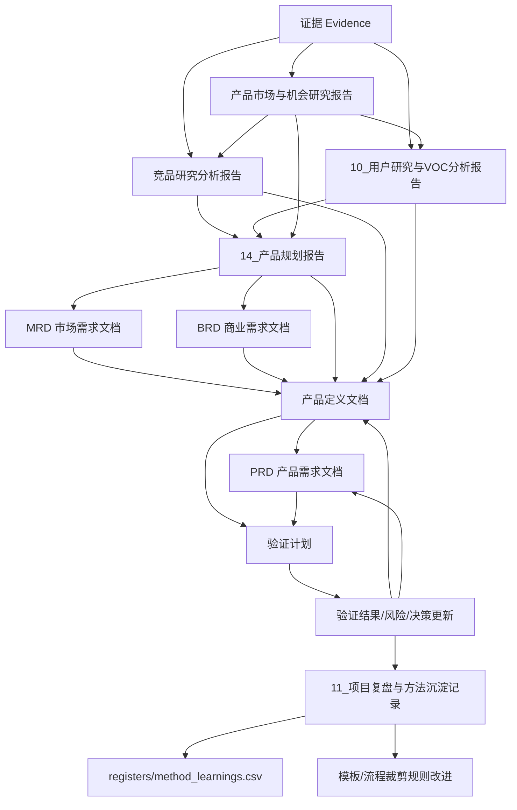

# 文档关系与追踪说明

## 1. 使用目的

### 方法说明

本文件用于说明产品规划、产品定义、PRD 和验证文档之间的输入输出关系。它不是额外流程，而是防止结论无依据、文档重复、版本漂移和经验无法沉淀的工作规则。

### 内容说明

产品经理在使用模板前，应先阅读本文件，明确每份文档从哪里取输入、输出给谁、哪些内容是主数据、如何追踪证据和决策。

## 2. 文档流转图

### 方法说明

使用一张总览图帮助团队理解研究、定义、需求和验证的流转关系。图谱用于理解，真正管理项目要依赖后面的主数据归属表、追踪矩阵和裁剪后输入补齐机制。

### 内容说明

研究证据进入研究报告和专项报告，再提炼为 MRD、BRD、产品定义、PRD 和验证计划。

## 3. 文档输入输出关系

### 方法说明

每份文档都必须明确输入和输出。输入不清，文档就会变成主观判断；输出不清，文档就无法被下游使用。

### 内容说明

以下表格定义完整流程中的文档关系。标准流程和轻量流程可以裁剪文档形式，但不能裁剪关键判断；被裁剪文档的关键输入必须通过继承、替代证据或缺口清单补齐。

| 文档 | 主要输入 | 主要输出 | 下游使用者 |
|-|-|-|-|
| 项目启动卡 | 项目来源、业务目标、已知约束 | 项目类型、流程裁剪、启动结论 | 产品、业务、研发、管理层 |
| 产品市场与机会研究报告 | 项目启动卡、证据、行业资料、初步竞品线索、用户/渠道信息 | 五看扫描、候选用户人群、核心竞品/替代方案初筛、专项研究任务、关键假设 | 竞品研究、用户研究、产品规划 |
| 竞品研究分析报告 | 产品市场与机会研究的核心竞品/替代方案清单、桌面数据、购买安装、拆机、BOM、评论 | 竞品缺口、成本目标、体验机会、工程约束、风险 | 产品规划、MRD、BRD、产品定义、PRD、验证计划 |
| 用户研究与VOC分析报告 | 产品市场与机会研究的候选用户人群、用户访谈、观察、评论、售后、客服、销售、渠道反馈 | 用户细分、角色链、核心场景、JTBD、旅程、VOC 主题、痛点优先级 | 产品规划、MRD、产品定义、PRD、验证计划 |
| 产品规划报告 | 产品市场与机会研究、竞品研究、用户研究、商业/内部能力判断 | 正式三定、目标市场、目标用户、定位、MVP、路线图、关键风险 | MRD、BRD、产品定义 |
| MRD | 产品规划报告、市场与机会研究、竞品研究、用户/VOC | 目标市场、市场需求、机会优先级 | 产品定义、BRD |
| BRD | 产品规划报告、MRD、成本/渠道/资源假设 | 商业目标、投入产出、立项建议 | 产品定义、管理决策 |
| 产品定义文档 | 产品规划报告、MRD、BRD、竞品研究、用户研究、证据、假设、风险 | 定位、目标用户、JTBD、MVP、边界、路线图 | PRD、验证计划、营销/销售 |
| PRD | 产品定义、用户故事地图、技术约束 | 功能需求、流程、规则、状态、验收标准 | 研发、测试、设计、验证计划 |
| L1 轻量产品定义/PRD 合并文档 | 项目启动卡、替代证据、历史 PRD、客户输入、售后/法规/变更来源 | 最小产品定义、功能需求、验收标准、验证输入 | 研发、测试、项目评审 |
| 验证计划 | 产品定义、PRD、假设、风险 | 验证项、通过标准、风险关闭结论 | 项目评审、下一阶段决策 |
| 项目复盘与方法沉淀记录 | 验证结果、阶段评审、上市反馈、售后数据、项目偏差 | 项目复盘、方法修正、模板改进建议、流程裁剪经验 | 团队方法库、下一项目启动卡、模板更新 |

## 3A. 裁剪后输入补齐机制

### 方法说明

流程裁剪的本质是减少重复文档，而不是减少判断依据。完整流程依靠文档链传递输入；标准流程和轻量流程必须依靠"输入来源表、替代证据、缺口清单"传递输入。没有证据时，不能把假设写成事实。

### 内容说明

每个被裁剪流程都必须回答三件事：下游必需文档需要哪些输入、这些输入从哪里来、缺失输入如何处理。

### 裁剪原则

- 可以跳过文档，不能跳过判断。
- 可以合并文档，不能合并成无来源结论。
- 没有证据不能打低风险，缺失证据至少按中风险处理。
- 直接进入 PRD 的前提是已有等价输入，而不是启动卡本身足够支撑 PRD。
- 缺失但不阻塞当前阶段的输入，进入 assumptions 或 risks，并写入下一步动作。
- 缺失且会影响范围、定位、成本、认证或交付的输入，必须补齐后才能进入下一阶段。

### 三档流程与必需文档

| 流程级别 | 适用项目 | 必需文档 | 被裁剪内容的补齐方式 |
|-|-|-|-|
| L3 完整流程 | 全新品类、新市场、高投入、高不确定性、强认证/供应链风险 | 项目启动卡、产品市场与机会研究、竞品研究、用户研究、产品规划、MRD、BRD、产品定义、PRD、验证计划 | 按完整文档链传递输入 |
| L2 标准流程 | 现有品类新型号、大版本升级、重要功能、明确客户定制 | 项目启动卡、MRD/BRD 合并版、必要专项研究、产品定义、PRD、验证计划 | 在 MRD/BRD 合并版中补齐市场、用户、竞品、商业判断的输入来源和缺口 |
| L1 轻量流程 | 小改款、配置变更、缺陷修复、法规/认证强制改动、低风险客户定制、复用模块 | 项目启动卡、L1 轻量产品定义/PRD 合并文档、验证清单或验证计划 | 在合并文档前置"输入来源与缺口说明"，用替代证据支撑 PRD |

### 输入来源状态

| 状态 | 定义 | 文档写法 |
|-|-|-|
| 已验证事实 | 有证据编号、历史数据、客户确认、验证结果或正式决策支撑 | 可以写成结论，并引用 evidence_id 或 decision_id |
| 阶段性判断 | 有替代证据，但覆盖范围有限 | 写明依据、限制和后续验证方式 |
| 假设 | 暂无充分证据，但需要作为当前方案前提 | 写入 assumptions.csv，不得写成事实 |
| 缺失输入 | 当前没有证据，且影响后续判断 | 写入缺口清单，指定负责人和截止时间 |

### 统一输入来源表

每份标准或轻量流程必需文档开头都应包含以下表格。

| 输入项 | 状态 | 来源/证据 | 影响 | 处理方式 |
|-|-|-|-|-|
| 目标市场 | 已知 / 假设 / 缺失 | 文档或 evidence_id | 高 / 中 / 低 | 继承 / 替代 / 补齐 |
| 目标用户 | 已知 / 假设 / 缺失 |  |  |  |
| 核心场景 | 已知 / 假设 / 缺失 |  |  |  |
| 竞品参照 | 已知 / 假设 / 缺失 |  |  |  |
| 商业理由 | 已知 / 假设 / 缺失 |  |  |  |
| 产品边界 | 已知 / 假设 / 缺失 |  |  |  |
| 关键约束 | 已知 / 假设 / 缺失 |  |  |  |
| 验收指标 | 已知 / 假设 / 缺失 |  |  |  |

### 缺少上游文档时的写法

| 情况 | 可接受写法 | 禁止写法 |
|-|-|-|
| 有证据 | "目标用户为安装商，依据 EV-xxx 售后记录和访谈。" | 不写来源 |
| 有替代证据 | "暂按 A 客户新房安装场景处理，依据客户需求书，尚未覆盖存量改造。" | 写成适用于全部用户 |
| 只有假设 | "假设用户愿意为安装效率付费，进入 assumptions，验证阶段补齐。" | 写成用户一定愿意付费 |
| 输入缺失 | "目标价格带缺失，阻塞成本目标，负责人在 xx 前补齐。" | 空着或凭经验填写 |

## 4. 台账输入来源规则

### 方法说明

证据、假设、风险、决策不是凭空填写的表格，而是由各类研究、评审、验证和业务活动沉淀出的结构化台账。必须先定义输入来源，否则台账会变成事后补材料。

### 内容说明

以下规则定义各台账从哪里来，以及什么情况下必须登记。

| 台账 | 输入来源 | 必须登记的情况 | 输出去向 |
|-|-|-|-|
| evidence.csv | 行业资料、政策标准、官方统计、用户访谈、VOC、电商评论、竞品桌面研究、购买安装记录、拆机照片、BOM 估算、销售/渠道/售后反馈、验证结果 | 任何支撑关键结论、需求优先级、定位、成本目标、风险判断的材料 | 所有研究报告、MRD、BRD、产品定义、PRD、验证计划 |
| assumptions.csv | 产品市场与机会研究报告、产品规划报告、MRD、BRD、产品定义、PRD、竞品研究、用户研究、技术方案讨论 | 尚未验证但会影响立项、目标市场、定位、MVP、成本、供应链、认证、交付的判断 | 验证计划、阶段评审、风险表 |
| risks.csv | 市场变化、用户证据不足、竞品压力、技术不确定、供应链约束、认证要求、质量问题、售后问题、商业测算偏差 | 概率或影响为中/高，或会影响是否进入下一阶段的事项 | BRD、产品定义、PRD、验证计划、阶段评审 |
| decisions.csv | 立项会、阶段评审、范围裁剪、目标市场选择、定位选择、技术路线、供应链选择、验证结论 | 会影响项目方向、资源投入、范围边界、流程裁剪、关键技术/供应链选择的决策 | 所有下游文档和项目复盘 |
| method_learnings.csv | 阶段评审、项目复盘、验证偏差、上市反馈、售后数据、模板使用反馈 | 可复用到后续项目的方法修正、模板字段调整、流程裁剪规则、常见误判 | 团队方法库、模板更新、下一项目启动 |

## 5. 市场扫描、专项研究与产品规划的关系

### 方法说明

产品市场与机会研究负责提出候选用户、核心竞品和待验证问题；竞品研究和用户研究负责专项验证；产品规划报告负责综合这些输入形成正式三定。专项研究不需要重写市场研究全文，只需要更新假设状态，并把结论输入产品规划报告。

### 内容说明

研究启动建议遵循以下关系：

| 研究类型 | 启动输入 | 反向影响 |
|-|-|-|
| 产品市场与机会研究报告 | 项目启动卡、初始行业/市场/客户/竞争线索 | 提出候选用户人群、核心竞品/替代方案、机会假设和专项研究任务 |
| 竞品研究分析报告 | 核心竞品/替代方案清单、价格带、用户场景假设、待验证问题 | 验证竞品格局、成本目标、结构方案、安装售后风险，并输入产品规划 |
| 用户研究与VOC分析报告 | 候选用户人群、核心场景假设、售后/销售/评论线索、待验证问题 | 验证并收敛用户细分、角色链、JTBD、用户旅程、痛点优先级，并输入产品规划 |
| 产品规划报告 | 市场与机会研究、竞品研究、用户研究、商业和内部能力判断 | 形成正式三定，输出给 MRD、BRD 和产品定义 |

### 方法组合落位规则

产品市场与机会研究报告采用"华为五看三定 + 麦肯锡分析方法 + 波特行业/竞争体系"的组合方法，但三类方法的职责不同，不能混成同一个表。

| 方法 | 主要落位 | 使用方式 | 注意事项 |
|-|-|-|-|
| 华为五看三定 | 五看在产品市场与机会研究报告，三定在产品规划报告 | 五看组织研究目录，三定形成正式规划决策 | 五看可以形成阶段性机会判断，但不直接替代最终三定 |
| 麦肯锡方法 | 问题树、每个五看章节、一页结论 | 用 MECE、问题树、假设驱动、证据链和金字塔表达保证分析严谨 | 每章都要写清问题、假设、证据、分析、结论和不确定性 |
| 波特方法 | 看行业、看竞争、看自身 | 用五力模型、价值链、利润池、竞争优势判断行业吸引力和进入难度 | 波特方法用于结构判断，不替代用户研究和竞品专项事实 |

### 看行业的五个子模块

| 子模块 | 核心判断 | 主要方法 | 输出去向 |
|-|-|-|-|
| 政策与监管研究 | 是否存在准入、补贴、限制、强制标准或合规门槛 | PEST、法规/标准扫描、假设驱动 | risks、产品定义、验证计划 |
| 技术趋势研究 | 技术是否成熟、成本是否下降、技术路线是否变化 | 技术路线图、成熟度曲线、问题树 | 技术预研、产品规划 |
| 产业链/价值链研究 | 产业由哪些环节组成，利润和控制点在哪里 | 波特价值链、产业链图、利润池分析 | BRD、供应链、产品规划 |
| 市场结构与规模分析 | 市场多大、增长在哪里、天花板在哪里 | MECE 细分、TAM/SAM/SOM、渗透率/替换率分析 | MRD、产品规划 |
| 行业格局与核心玩家 | 行业集中度、核心玩家、替代品和进入壁垒如何 | 波特五力、战略群组、竞争优势分析 | 看竞争、竞品研究 |

### 竞品研究的两层分工

| 层级 | 主维护文档 | 核心问题 | 输出 |
|-|-|-|-|
| 竞争扫描 | 产品市场与机会研究报告 | 和谁竞争，用户用什么替代，哪些对象值得深挖 | 核心竞品、替代方案、初步优劣势、机会缺口、专项研究任务 |
| 专项竞品研究 | 竞品研究分析报告 | 竞品为什么赢，哪里弱，成本/结构/体验/售后风险是什么 | 桌面数据、购买安装、拆机、BOM、成本目标、工程约束、产品定义输入 |

### 用户研究的两层分工

| 层级 | 主维护文档 | 核心问题 | 输出 |
|-|-|-|-|
| 用户人群初筛 | 产品市场与机会研究报告 | 可能服务哪些人群，谁购买/决策/使用/安装/维护 | 候选用户人群、候选角色链、场景假设、待验证问题 |
| 专项用户研究 | 用户研究与VOC分析报告 | 哪些人群痛点真实且高价值，任务和旅程是什么 | 用户细分、角色链、核心场景、JTBD、旅程、痛点优先级 |
| 用户选择决策 | 产品规划报告 | 首版到底服务谁，不服务谁，为什么 | 目标用户、非目标用户、核心场景、MVP 输入 |

## 6. 目标市场变更规则

| 变化来源 | 处理方式 | 需要更新的文档 |
|-|-|-|
| 公司战略或管理决策 | 在 decisions.csv 记录决策背景、决策人、影响范围；MRD 更新目标市场 | MRD、BRD、产品定义、路线图 |
| 外部市场变化 | 补充产品市场与机会研究报告，记录新证据；必要时重开产品规划决策 | 产品市场与机会研究、产品规划报告、MRD、BRD、产品定义 |
| 用户/竞品/验证发现 | 回写对应专项报告和 evidence.csv；评估原 MRD 是否失效 | 用户研究/VOC、竞品研究、MRD、产品定义、PRD、验证计划 |

## 7. 主数据归属

| 对象 | 主维护位置 | 可引用文档 | 维护规则 |
|-|-|-|-|
| 证据 | registers/evidence.csv | 所有文档 | 每条关键结论至少关联一个证据 ID |
| 假设 | registers/assumptions.csv | 研究报告、BRD、产品定义、验证计划 | 高风险假设必须进入验证计划 |
| 风险 | registers/risks.csv | BRD、产品定义、PRD、验证计划 | 风险状态随验证结果更新 |
| 决策 | registers/decisions.csv | 所有文档 | 关键裁剪、立项、范围、定位和技术选择都要记录 |
| 市场与机会发现 | 产品市场与机会研究报告 | 产品规划报告、MRD、BRD、产品定义 | 下游只摘录结论和证据编号 |
| 正式产品规划结论 | 产品规划报告 | MRD、BRD、产品定义、PRD、验证计划 | 三定、MVP 和路线图以产品规划报告为准 |
| 核心竞品/替代方案清单 | 产品市场与机会研究报告 | 竞品研究分析报告、产品规划报告、MRD、产品定义 | 市场与机会研究负责初筛；竞品报告负责深挖；产品规划报告负责选择对标 |
| 竞品深度研究结论 | 竞品研究分析报告 | 产品规划报告、MRD、BRD、产品定义、PRD、验证计划 | 桌面数据、购买安装、拆机、BOM、成本推断和工程约束统一在竞品报告维护 |
| 候选用户人群 | 产品市场与机会研究报告 | 用户研究与VOC分析报告、产品规划报告 | 市场与机会研究负责初筛，用户研究负责验证和收敛 |
| 用户研究/VOC | 用户研究与VOC分析报告 | 产品规划报告、MRD、产品定义、PRD、验证计划 | 用户原话、访谈、评论、售后和观察结果统一在此维护 |
| 目标市场 | MRD | BRD、产品定义 | 变更目标市场必须更新 MRD |
| 市场需求 | MRD | 产品定义、PRD | 需求进入产品定义前要有优先级 |
| 商业目标 | BRD | 产品定义、路线图 | 产品范围变化要检查商业目标影响 |
| 产品定位 | 产品定义文档 | PRD、营销、销售资料 | PRD 不重新定义定位 |
| JTBD | 产品定义文档 | 用户故事地图、PRD | 每条 JTBD 应关联用户证据或研究发现 |
| 用户旅程 | 用户研究与VOC分析报告 / 产品定义文档 | PRD、验证计划 | 用户研究维护全链路观察，产品定义维护本产品采用版本 |
| 用户故事 | PRD | 验证计划 | 用户故事必须能追溯到 JTBD 或旅程痛点 |
| 功能需求 | PRD | 验证计划 | 每条 P0/P1 需求必须有验收标准 |
| 验证项 | 验证计划 | 风险、假设、PRD | 验证结果要回写风险和假设状态 |
| 方法沉淀 | 项目复盘与方法沉淀记录 / registers/method_learnings.csv | README、流程裁剪判断表、下一项目启动卡 | 可复用经验必须转成模板、规则或检查项 |

## 8. 追踪矩阵规则

使用 registers/traceability.csv 维护核心链路。高优先级需求、关键定位、重大风险和关键假设都必须进入追踪矩阵。

| 字段 | 说明 |
|-|-|
| trace_id | 追踪编号 |
| research_finding | 研究发现 |
| market_need | 市场/用户需求 |
| product_definition | 产品定义条目，如定位、JTBD、MVP、边界 |
| requirement_id | PRD 需求编号 |
| validation_item | 验证项 |
| evidence_id | 证据编号 |
| status | 待验证 / 已验证 / 已变更 / 已废弃 |
| notes | 备注 |

## 9. 方法闭环

复盘内容主维护在 `11_项目复盘与方法沉淀记录.md`，可复用的结构化经验同步进入 `registers/method_learnings.csv`。

### 阶段评审问题

- 关键结论是否有证据编号？
- 高风险假设是否进入验证计划？
- 产品定义是否能追溯到 MRD/竞品/用户证据？
- PRD 的 P0/P1 需求是否能追溯到产品定义？
- 哪些结论只是判断，尚未被验证？
- 哪些流程被裁剪，裁剪理由是否记录？

### 项目复盘问题

- 哪些研究结论被后续验证证明是正确的？
- 哪些判断错误，原因是证据不足、方法错误还是环境变化？
- 哪些竞品分析结论真正影响了产品定义？
- 哪些需求后来被证明不是用户真实需求？
- 哪些模板字段没有价值，可以删减？
- 哪些缺失字段导致后续返工，应该补进模板？

### 闭环路径

| 步骤 | 动作 | 产出 |
|-|-|-|
| 1 | 验证计划、上市反馈、售后数据暴露偏差 | 验证结果、问题、风险状态 |
| 2 | 项目复盘判断偏差原因 | 项目复盘记录 |
| 3 | 提炼可复用方法经验 | method_learnings.csv |
| 4 | 修改模板、流程裁剪规则或检查项 | 模板版本更新 |
| 5 | 下一项目启动时复用 | 项目启动卡和研究计划 |

## 10. 最小执行要求

所有项目至少保留以下内容：

| 最小项 | 说明 |
|-|-|
| 一页结论 | 做什么、为什么、给谁做、不做什么 |
| 证据编号 | 关键判断必须可追溯 |
| 假设编号 | 未验证但影响决策的判断必须记录 |
| 风险编号 | 高影响风险必须记录和关闭 |
| 产品定义 | 目标用户、场景、定位、MVP、边界 |
| PRD 验收标准 | 功能需求必须可测试 |
| 验证结果 | 验证后要回写假设和风险状态 |
