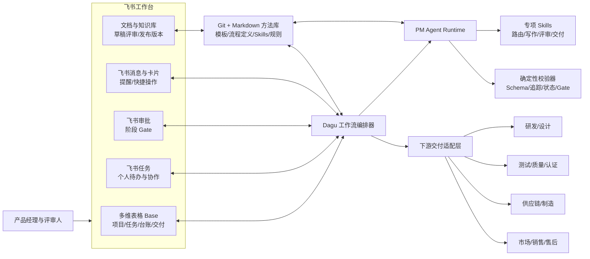
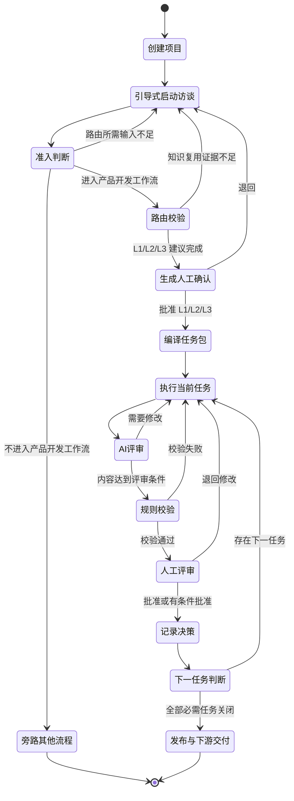

# AI 产品经理工作流方案 A 详细设计

> 文档状态：讨论稿 v0.1  
> 适用范围：项目启动至 PRD、验证计划完成并向下游团队交付  
> 设计日期：2026-07-16  
> 当前结论：采用“确定性工作流编排 + 专项 AI Agent + 飞书工作台 + Git/Markdown 方法库”的组合架构

## 1. 文档目的

本文件把产品经理工作流的架构讨论转成可评审、可实施的系统设计。它回答以下问题：

- 如何把“新建项目 -> 输入项目启动卡 -> 判断流程 -> 拆解任务 -> 执行 -> Review -> 审核验证 -> 人工决策 -> 下一任务”变成可重复运行的 AI 工作流。
- 飞书、工作流引擎、AI Agent、现有 Markdown 模板和下游团队分别承担什么职责。
- 哪些数据由哪个系统主维护，如何避免文档、任务和决策状态互相冲突。
- 如何让 PRD、验证计划和结构化台账可靠地传递给研发、测试、供应链、质量和商业团队。
- 方案 A 可以整合哪些现成开源项目、飞书工具和 Agent Skills。

本文件是系统设计，不替代现有产品方法模板。产品方法仍以本模板包的启动卡、流程裁剪、任务包、PRD、验证计划和 registers 为准。

## 2. 目标、边界与成功标准

### 2.1 建设目标

1. 将现有 L1/L2/L3 产品流程编译成可执行任务，而不是只生成一组文档目录。
2. 让 AI 负责资料整理、草稿生成、一致性检查、评审准备和交付打包。
3. 让确定性规则负责状态流转、必填检查、追踪关系、权限和审计。
4. 让人保留流程裁剪、关键范围、阶段 Gate 和最终发布的决策权。
5. 让批准后的产出可以按团队职责拆包并传递到下游。
6. 逐步沉淀为可复用工作流、可移植 Skills，最终形成产品经理工作流 Agent。

### 2.2 当前阶段边界

本方案第一阶段覆盖：

```text
项目创建
-> 资料接入与 source-manifest
-> 引导式项目启动访谈
-> 是否进入智能硬件产品开发工作流
-> L1 产品变更 / L2 产品衍生 / L3 新产品路由
-> 项目任务包
-> 文档、专项研究与验证任务执行
-> AI Review
-> 规则校验
-> 人工评审与 Gate 决策
-> PRD/验证计划发布
-> 下游交付与签收
```

暂不纳入第一阶段：

- 研发团队内部的 Sprint、代码、ECN/ECR、BOM、缺陷和测试执行全过程。
- ERP、PLM、MES、CRM 等企业系统的双向深度集成。
- AI 代替管理者作出立项、范围冻结、风险接受或发布决定。
- 自动对外发函、签约、采购或作出资源承诺。

项目启动访谈的详细问题树、会话状态、逐问规则、复杂阻塞地图和停止条件以 `16_项目启动引导式访谈与路由信息补全方案.md` 为准。本设计负责系统编排，不在此重复维护问题库。

### 2.3 成功标准

| 维度 | 第一阶段成功标准 |
|---|---|
| 流程 | 一个符合新定义的 L1 产品变更可从启动访谈运行到新版 PRD/验证清单发布，无需人工复制任务 |
| 数据 | 项目、任务、文档、评审、决策、交付均有唯一 ID 和主数据位置 |
| 质量 | P0/P1 需求有验收标准，关键假设/风险有验证路径，阻塞缺口不能被静默跳过 |
| 决策 | 所有阶段 Gate 均由指定人员在飞书完成，并写入 decision_id |
| 交付 | 下游团队收到与其职责相关的已批准版本，并能确认接收或退回 |
| 审计 | 能回答谁在何时基于哪个版本、证据和评审结果作出了什么决定 |
| 复用 | 同一套流程定义能创建第二个项目，不依赖复制旧项目手工改造 |

## 3. 设计原则

### 3.1 确定性骨架，Agent 执行

流程状态、任务依赖、Gate、权限、必填字段和重试必须由规则控制；AI 负责需要理解、归纳、生成和批判性审查的工作。

### 3.2 一个对象只能有一个主维护位置

同一对象可以在多个系统显示，但只能有一个系统负责最终状态。其他位置保存引用、快照或同步副本。

### 3.3 文档完成不等于任务关闭

只有输入完整、输出符合契约、规则校验通过、评审结论明确、必要记录已回写时，任务才能关闭。

### 3.4 先准入，再分级

普通修复、质量整改、生产异常、等效物料或供应商变更、不改变产品定义的认证整改，以及无产品规则变化的轻量软件或文案修改，旁路到对应专业流程。只有需要完整或新版智能硬件 PRD、且需要产品判断的事项才进入 L1/L2/L3。

### 3.5 按知识复用深度分级

L1 复用既有产品定位和有效 PRD，完成产品变更与新版 PRD；L2 复用品类研究，针对同品类新 SKU 的差异补充专项研究；L3 面向新品类或新市场，从头完成研究和产品定义。风险用于修正专项任务、验证深度与 Gate 条件，不作为等级的唯一依据。

### 3.6 AI 输出默认是草稿

Agent 可以提出建议、生成草稿和评审意见，但不能自行把关键产出标记为“人工批准”或替代 Gate 决策人。

### 3.7 先闭环，再扩展

MVP-1 已用两个历史样例验证本地编排和校验骨架；后续业务验证应选择符合新定义的 L1 产品变更，再扩展 L2/L3、复杂事件驱动和组织级系统集成。历史样例不作为新的业务分类标准。

### 3.8 以路由就绪为访谈完成条件

启动访谈不追求项目全部信息完备。Agent 先从资料获取事实，再按依赖一次询问一个会改变准入、产品对象、知识复用或风险处理的变量；达到 `route_ready`、`blocked` 或 `out_of_scope` 即停止。PRD 细节留给路由批准后的任务访谈。

## 4. 总体架构



### 4.1 各层职责

| 层 | 核心职责 | 不承担的职责 |
|---|---|---|
| 飞书工作台 | 人员入口、项目看板、任务协作、文档评审、审批、通知、交付签收 | 不负责复杂 DAG 编排和 AI 运行日志 |
| 工作流编排器 | 依赖、状态、重试、暂停、人工 Gate、运行记录、定时和事件触发 | 不负责产品判断和长文写作 |
| PM Agent Runtime | 执行 Skills，读取上下文，生成或 Review 产物，返回结构化结果 | 不拥有最终业务状态和人工决策 |
| 规则校验器 | 必填、Schema、引用完整性、追踪覆盖率、状态迁移和 Gate 条件 | 不用语言模型替代确定性检查 |
| Git/Markdown 方法库 | 模板、方法、流程定义、Skills、校验规则和版本历史 | 不作为普通成员的日常任务工作台 |
| 下游适配层 | 按团队生成交付包、发送通知、创建下游任务、记录签收 | 第一阶段不替代 PLM/Jira/测试平台 |

## 5. 主数据与版本归属

### 5.1 系统主数据表

| 对象 | 主维护位置 | 其他系统中的形态 | 规则 |
|---|---|---|---|
| 模板、方法、流程定义 | Git/Markdown | 飞书知识库发布副本 | 修改先进入版本库，批准后发布 |
| Skill 与校验脚本 | Git | Agent 运行时加载副本 | 以版本号和提交标识引用 |
| 项目基本信息 | 飞书 Base Projects | 项目目录下 project manifest | Base 是业务状态主数据 |
| 启动原始资料 | 原文件/文档所在的本地目录、飞书、云盘或业务系统 | `source-manifest` 中的索引 | 不复制为第二份可编辑全文 |
| 启动资料清单 | 飞书 Base Source Manifests 或项目目录 JSON | `intake-session` 中的版本引用 | 清单维护位置、版本/哈希、权限、敏感级别和读取状态 |
| 业务任务 | 飞书 Base Tasks | 飞书任务中的个人待办；Dagu 中的运行节点 | Base 维护业务语义和状态 |
| 技术运行状态 | Dagu | Base 中的 execution_phase 摘要 | Dagu 维护重试、日志和运行细节 |
| 结构化台账 | 飞书 Base 对应表 | Git 中 CSV 快照 | Base 负责协作编辑，CSV 用于审计、校验和迁移 |
| 文档工作草稿 | 项目 Git/Markdown 工作副本 | 飞书文档评审副本 | 同一评审周期只指定一个可编辑主副本 |
| 人工评审版/发布版 | 飞书文档或知识库 | Git 中批准快照 | 版本号、内容哈希和关联 decision_id 必须一致 |
| 阶段 Gate 决策 | 飞书审批 | decisions 表/CSV 的镜像记录 | 审批结果为原始决策事实 |
| 下游交付与签收 | 飞书 Base Deliveries | 下游系统任务或消息 | Base 维护发送、接收、退回和变更状态 |

### 5.2 防止“双主数据”的同步规则

- 同步方向必须在 manifest 中声明，禁止同一时刻双向自由编辑。
- 发布前执行版本比较；目标端有未同步修改时停止覆盖并转人工处理。
- 每次同步记录 source_version、target_version、content_hash、operator、time 和 result。
- 飞书文档的评论和评审意见是协作数据，不直接覆盖本地源文档；应先形成修改任务。
- 决策表保存审批结果摘要，不伪造或替换原始审批记录。

## 6. 飞书工作台设计

### 6.1 工作台信息架构

建议建立一个“产品工作流”飞书知识空间或工作台主页，包含：

```text
产品工作流首页
├── 项目总览（Base）
├── 我的任务（飞书任务 / Base 个人视图）
├── 待评审（Base Review 视图）
├── 待审批（飞书审批）
├── 风险与阻塞（Base 仪表盘）
├── 下游交付与签收（Base）
├── 产品方法库（Wiki）
└── 项目空间
    └── PRJ-XXXX 项目名称
        ├── 00 项目启动卡
        ├── 01 当前任务包
        ├── 02 工作文档
        ├── 03 评审记录
        ├── 04 已批准交付物
        └── 05 决策与变更
```

### 6.2 Base 核心数据表

#### Projects：项目表

| 字段 | 类型 | 说明 |
|---|---|---|
| project_id | 文本，唯一 | PRJ-YYYY-NNN |
| project_name | 文本 | 项目名称 |
| project_source | 单选 | 市场机会/客户定制/售后/降本/法规/预研/其他 |
| workflow_level | 单选 | L1/L2/L3/待判断 |
| current_stage | 单选 | 启动/研究/规划/定义/PRD/验证计划/交付/完成 |
| business_status | 单选 | 未开始/进行中/待评审/已关闭/阻塞/取消 |
| current_task_id | 关联 | 当前生效任务 |
| product_owner | 人员 | 产品负责人 |
| gate_owner | 人员 | 当前 Gate 决策人 |
| intake_session_id | 文本 | 当前启动访谈会话 |
| intake_state | 单选 | discovering/asking/reviewing/blocked/out_of_scope/route_ready |
| scope_status | 单选 | pending/in_scope/out_of_scope/blocked |
| workspace_url | URL | 项目文档空间 |
| workflow_run_id | 文本 | 当前 Dagu 运行实例 |
| created_at/updated_at | 日期时间 | 审计字段 |

#### Source Manifests：启动资料清单

| 字段 | 类型 | 说明 |
|---|---|---|
| manifest_id | 文本，唯一 | SRCMAN-项目-序号 |
| project_id | 关联 | 所属项目 |
| manifest_version | 文本 | 清单版本；资料增删或有效版本变化时递增 |
| collection_status | 单选 | collecting/ready/blocked |
| declaration | 单选 | sources_provided/none_available |
| sources | JSON/关联 | source_id、标题、类型、位置、版本/哈希、访问状态、敏感级别、读取状态、路由相关性和提取 fact_id |
| updated_at | 日期时间 | 恢复、重算和审计时间 |

原始文件仍由本地目录、飞书文档、云盘或业务系统主维护。资料清单是索引和处理记录，不建立第二份可编辑全文。

#### Intake Sessions：启动访谈会话表

| 字段 | 类型 | 说明 |
|---|---|---|
| intake_session_id | 文本，唯一 | INTAKE-项目-序号 |
| project_id | 关联 | 所属项目 |
| input_version | 文本 | 本轮访谈输入版本 |
| source_manifest_ref | 文本/URL | 本轮使用的资料清单 |
| source_manifest_version | 文本 | 资料清单版本；变化时只重算受影响分支 |
| source_discovery_status | 单选 | collecting/ready/declared_none/blocked |
| mode | 单选 | interactive/async |
| state | 单选 | discovering/asking/reviewing/blocked/out_of_scope/route_ready/closed |
| current_branch | 单选 | sources/scope/product_object/baseline/reuse/differences/risk/delegation/summary/complete |
| facts | JSON/关联 | 带来源、状态、置信度和路由影响的事实 |
| questions | JSON/关联 | 问题、推荐答案、回答和状态 |
| route_snapshot | JSON | 准入、产品对象、知识复用、候选等级和 Gate 就绪状态 |
| not_yet_specified | 多行文本/JSON | 尚不能准确表述成问题的路由迷雾 |
| out_of_scope_notes | 多行文本/JSON | PRD、实施或旁路流程内容 |
| updated_at | 日期时间 | 恢复与审计时间 |

#### Intake Gaps：启动输入缺口表

| 字段 | 类型 | 说明 |
|---|---|---|
| gap_id | 文本，唯一 | GAP-项目-序号 |
| intake_session_id | 关联 | 所属访谈会话 |
| variable | 文本 | 被阻塞的路由变量 |
| gap_type | 单选 | research/decision/prototype/access_task |
| interaction | 单选 | afk/hitl |
| blocking | 复选框 | 是否阻塞准入或 L1/L2/L3 判断 |
| depends_on | 多关联 | 关闭后才能进入当前前沿的前置缺口 |
| owner | 人员/角色 | 事实、决策或动作负责人 |
| expected_source | 文本/URL | 预期文档、数据、系统、原型或决策 |
| next_action | 多行文本 | 关闭缺口所需动作 |
| due_at | 日期时间 | 路由需要该输入的时间 |
| status | 单选 | open/claimed/resolved/accepted_non_blocking |

#### Tasks：业务任务表

| 字段 | 类型 | 说明 |
|---|---|---|
| task_id | 文本，唯一 | 项目内稳定编号 |
| project_id | 关联 | 所属项目 |
| task_type | 单选 | 文档/输入补齐/研究/评审/验证/决策/交付 |
| workflow_node | 文本 | 对应流程定义节点 |
| depends_on | 多关联 | 前置任务 |
| input_contract | 多行文本/JSON | 必须输入及版本 |
| output_contract | 多行文本/JSON | 输出格式及关闭标准 |
| owner | 人员 | 业务负责人 |
| agent_skill | 文本 | 调用的 Skill 名称和版本 |
| business_status | 单选 | 沿用现有六状态 |
| execution_phase | 单选 | queued/preparing/running/checking/reviewing/waiting_gate/publishing/syncing/done/error |
| artifact_ids | 多关联 | 关联产物 |
| related_ids | 多行文本 | evidence/assumption/risk/decision/requirement ID |
| retry_count | 数字 | 技术重试次数 |
| blocked_reason | 多行文本 | 阻塞原因及解除条件 |
| due_at | 日期时间 | 截止时间 |

#### Artifacts：产物表

| 字段 | 类型 | 说明 |
|---|---|---|
| artifact_id | 文本，唯一 | ART-项目-序号 |
| project_id/task_id | 关联 | 来源项目与任务 |
| artifact_type | 单选 | 启动卡/研究/MRD/BRD/定义/PRD/验证计划/评审报告/交付包 |
| title | 文本 | 产物标题 |
| source_path | 文本 | Git/本地源文件路径 |
| feishu_url | URL | 飞书评审或发布地址 |
| version | 文本 | 业务版本号 |
| content_hash | 文本 | 防止版本漂移 |
| maturity_status | 单选 | planned/draft/reviewed/approved/superseded |
| review_id | 关联 | `reviewed` 版本的 Review 依据 |
| approved_decision_id | 关联 | 批准依据 |
| superseded_by_artifact_id | 关联 | 取代当前版本的新产物 |
| published_at | 日期时间 | 发布时间 |

#### Reviews：评审表

| 字段 | 类型 | 说明 |
|---|---|---|
| review_id | 文本，唯一 | 评审编号 |
| artifact_id | 关联 | 被评审产物 |
| review_type | 单选 | AI内容评审/规则校验/同级评审/跨团队评审 |
| reviewer | 人员或 Agent | 评审主体 |
| verdict | 单选 | 通过/有条件通过/退回/阻塞 |
| findings | 多行文本 | 发现摘要 |
| finding_records | 关联 | 结构化问题记录，可后续拆表 |
| reviewed_version | 文本 | 防止评错版本 |
| created_at | 日期时间 | 评审时间 |

#### Decisions：决策表

在现有 decisions.csv 字段基础上，增加 project_id、gate_type、approval_instance_id、artifact_version、effective_scope 和 supersedes_decision_id。

#### Deliveries：下游交付表

| 字段 | 类型 | 说明 |
|---|---|---|
| delivery_id | 文本，唯一 | 交付编号 |
| project_id | 关联 | 项目 |
| team | 单选 | 设计/结构/硬件/固件/App/云端/测试/质量/认证/供应链/制造/市场/销售/售后 |
| package_type | 单选 | 需求包/验证包/决策包/变更包 |
| artifact_versions | 多关联 | 交付的批准版本 |
| requirement_filter | 多行文本 | 该团队相关需求范围 |
| recipient | 人员/群组 | 接收人或团队 |
| delivery_status | 单选 | 待生成/待发送/已发送/已接收/有疑问/退回/已失效 |
| downstream_task_url | URL | 下游任务系统引用 |
| sent_at/ack_at | 日期时间 | 发送与签收时间 |
| change_notice_id | 文本 | 后续变更通知链 |

### 6.3 Base 视图建议

- 管理层：项目阶段、Gate、阻塞、高风险和逾期总览。
- 产品负责人：我的项目、当前任务、待补输入、待发布产物。
- 评审人：待我评审、待我决策、退回待修改。
- 下游团队：待接收、已接收、有疑问、已失效交付包。
- 流程管理员：运行异常、同步失败、重试次数、Schema 校验失败。

### 6.4 飞书任务与 Base Tasks 的关系

- Base Tasks 是项目业务任务主数据，适合结构化管理和流程查询。
- 飞书任务是人员的执行入口，适合个人待办、子任务、提醒和协作。
- 创建或指派 Base 任务时，可生成对应飞书任务，并保存 task_guid。
- 飞书任务完成不能直接关闭业务任务；系统还要检查输出、规则和评审条件。
- 业务任务关闭后，系统同步完成飞书任务，避免两个状态各自流转。

### 6.5 两级评审机制

| 层级 | 使用方式 | 适用场景 | 结果 |
|---|---|---|---|
| 任务级 Review | Base 评审记录、文档评论、交互卡片 | 草稿检查、同级评审、修改确认 | 通过/退回/阻塞，不代表阶段 Gate |
| 阶段级 Gate | 飞书原生审批 | 流程裁剪、产品定义、PRD、验证计划发布 | 批准/有条件批准/拒绝/撤回，并产生 decision_id |

## 7. 工作流编排设计

### 7.1 为什么选择独立编排器

飞书负责人与协作体验，但完整工作流还需要：

- DAG 依赖和分支。
- 暂停等待人工输入或审批。
- Agent 调用、超时、重试和日志。
- 保存运行状态和中间产物。
- 同一个流程定义被多个项目重复实例化。
- 失败后从安全节点恢复，而不是重新执行全部步骤。

方案 A 建议以 Dagu 作为首选轻量编排器；若组织已有 Prefect 或 Kestra，可替换编排层，不改变上层数据契约。

### 7.2 项目级主流程



#### 7.2.1 启动访谈子流程

> 阶段状态：2026-07-21 初版归档保留为历史基线；2026-07-22 依 ADR-006 将 AI 路由复核内聚到启动模块，Gate 1 保持独立人工节点。

```text
接收文件、链接或系统位置
-> 建立 source-manifest 并记录版本、权限与敏感级别
-> 读取可访问资料并预填路由事实
-> 计算当前无阻塞的问题前沿
-> 互动模式只提出一个问题
-> 记录答案、来源、冲突或输入缺口
-> 重算准入、产品对象、知识复用和候选等级
-> 候选等级形成后扫描风险与任务修正
-> 用户确认 Gate 1 事实摘要
-> reviewing：启动模块内 AI 路由复核
-> Schema 与确定性校验
-> reviewed 启动卡 + Gate 简报 + route Review + route-gate-request
-> route_ready / blocked / out_of_scope
-> 独立人工 Gate 1
```

用户只负责提供资料入口或确认没有现成资料，不负责把内容手工抄入启动卡。资料发现状态为 `collecting` 或 `blocked` 时不开始路由提问；关键资料访问失败转为 `access_task`。原始资料仍由其源系统主维护，会话只保留引用和提取事实。

常规项目直接运行该循环。只有跨角色、跨资料且单次会话无法收敛时，才启用轻量 Wayfinder 模式：目的地固定为“Gate 1 路由建议就绪”，阻塞项按 Research（AFK）、Decision（HITL）、Prototype（HITL）和 Access Task（AFK/HITL）分类，用 `depends_on` 计算当前前沿。尚不能准确表述的问题保留在 `not_yet_specified`；PRD 和实施内容明确放在本次路由目的地之外。

### 7.3 任务级标准闭环

每个任务都按相同契约运行：

```text
读取任务契约
-> 收集指定输入和版本
-> 检查输入缺口
-> 执行 Agent Skill 或人工任务
-> 保存草稿与结构化结果
-> AI Reviewer 审查
-> 确定性校验器检查
-> 人工 Review 或 Gate
-> 回写台账、决策和版本
-> 满足关闭标准后关闭
```

模块在执行期间可以保存 `draft` 便于恢复，但只有在模块内完成 AI Review 与确定性校验、并将产物定格为 `reviewed` 后，才能作为下游模块输入。`pmflow-review-artifact` 是模块内可复用的横切能力，不是主工作流中与业务模块并列的纵向环节。人工 Gate 仍保持独立，只能将其明确决策覆盖的精确版本推进到 `approved`。

任务的最小输入契约：

| 字段 | 说明 |
|---|---|
| task_id/project_id | 唯一身份 |
| objective | 本任务要完成的业务目标 |
| required_inputs | 输入对象、版本和最小质量要求 |
| allowed_tools | Agent 可调用的工具范围 |
| skill_name/version | 执行方法 |
| expected_outputs | 文件、记录、评审报告等输出 |
| validators | 必须通过的规则 |
| close_criteria | 关闭条件 |
| escalation_rule | 缺输入、冲突或高风险时交给谁 |

### 7.4 L1 流程定义示例

以下为逻辑示例，实施时保存为 `workflow/definitions/L1.yaml`：

```yaml
name: pmflow-l1
version: 0.2.0
inputs:
  - project_id
steps:
  - id: load_project
    run: pmflow.load_project

  - id: run_project_intake
    depends: [load_project]
    run: agent.skill
    with:
      skill: pmflow-project-intake

  - id: validate_gate_package
    depends: [run_project_intake]
    run: validators.route_gate_request

  - id: confirm_route
    depends: [validate_gate_package]
    type: human_approval
    approval: workflow_route_gate

  - id: compile_tasks
    depends: [confirm_route]
    run: pmflow.compile_tasks

  - id: create_l1_prd
    depends: [compile_tasks]
    run: agent.skill
    with:
      skill: pmflow-create-prd
      template: 12_L1_轻量产品定义_PRD合并文档.md
      internal_quality: [pmflow-review-artifact, validators.prd]

  - id: create_validation_plan
    depends: [create_l1_prd]
    run: agent.skill
    with:
      skill: pmflow-create-validation-plan
      internal_quality: [pmflow-review-artifact, validators.traceability]

  - id: prd_validation_gate
    depends: [create_validation_plan]
    type: human_approval
    approval: prd_validation_release_gate

  - id: publish_handoff
    depends: [prd_validation_gate]
    run: pmflow.publish_handoff
```

### 7.5 状态模型

业务状态继续沿用现有统一口径：

```text
未开始 / 进行中 / 待评审 / 已关闭 / 阻塞 / 取消
```

为避免把技术运行错误混进业务状态，增加 execution_phase：

```text
queued -> preparing -> running -> checking -> reviewing
-> waiting_gate -> publishing -> syncing -> done
```

任意技术步骤可进入 error，经有限重试后仍失败则：

- execution_phase = error；
- business_status 保持原状态或转阻塞；
- 写明错误、已重试次数、人工恢复动作和安全恢复点。

产物使用与任务状态独立的 `maturity_status`：

```text
planned -> draft -> reviewed -> approved -> superseded
```

- `reviewed` 代表指定版本已完成所需 AI/内容 Review 和确定性校验，不代表人工已批准。
- `approved` 必须关联对该版本的明确 `decision_id`。
- Review 的结论和 finding 保存在 Reviews 中，不增加产物状态。
- 已进入 `reviewed` 或 `approved` 的内容如果修改，创建新版本并将原版本转为 `superseded`。
- 文件存在不等于任务完成；任务关闭必须另行满足输出契约和关闭标准。

### 7.6 事件与触发

建议支持以下触发源：

| 触发事件 | 工作流动作 |
|---|---|
| Base 新项目记录完成 | 创建项目空间，校验启动卡 |
| 启动卡关键字段更新 | 创建新 `input_version`，重跑路由建议、AI Review 和校验，生成新 Gate 请求；不覆盖已批准版本 |
| 任务指派 | 创建飞书任务和提醒 |
| 文档提交评审 | 启动 AI Review 和规则校验 |
| 任务级 Review 通过 | 推进到下一规则或 Gate |
| 审批通过/拒绝 | 记录 decision_id，推进或退回 |
| 产物批准发布 | 生成团队交付包 |
| 下游退回 | 创建澄清/变更任务，不直接篡改已批准版本 |

第一阶段若某类飞书事件未被现成工具覆盖，可以采用有限频率轮询；所有轮询需使用游标、更新时间和幂等键，避免重复处理。

### 7.7 幂等与恢复

- 一般幂等键推荐使用 `project_id + workflow_node + input_version`；Gate 请求追加 `route_review_id`。
- 同一个输入版本不得重复创建项目、任务、审批和交付记录。
- Agent 重试前先检查目标产物是否已存在且哈希一致。
- 审批发起后保存 approval_instance_id，超时只查询状态，不重复发起。
- 发布失败不撤销已经批准的业务决策；恢复后继续同步和交付。
- 所有外部写操作保存 request_id、response_id 和结果摘要。

## 8. Agent 与 Skills 设计

### 8.1 是否可以成为一个 Agent

可以，但不建议做成一个拥有全部权限、靠单段 Prompt 自行决定流程的“大 Agent”。建议形态是：

```text
PM Workflow Agent（对外统一入口）
├── 路由与计划 Skills
├── 研究与证据 Skills
├── 文档生成 Skills
├── Review Skills
├── Gate 准备 Skills
└── 发布与交付 Skills
```

Agent 负责理解用户意图和执行具体任务；工作流引擎负责“下一步是什么、是否允许进入下一步”。

### 8.2 建议自建的核心 Skills

| Skill | 主要输入 | 主要输出 | 人工边界 |
|---|---|---|---|
| pmflow-project-intake | 文件/链接/系统位置、项目简述、既有产品/PRD、品类研究、历史决策和已知差异 | `source-manifest`、可恢复 `intake-session`、路由草案、AI 路由 Review、确定性校验结果、reviewed 启动卡与 Gate 简报、`route-gate-request` | 模块内部完成执行者与复核者两次逻辑检查；最高只能产出 `reviewed`，在独立人工 Gate 1 前停止 |
| pmflow-compile-tasks | 已批准流程、13 任务包规则 | 有依赖和关闭标准的任务清单 | 不自行删除必需 Gate |
| pmflow-execute-task | 任务契约、指定上下文 | 任务草稿、结构化记录、运行摘要 | 超出工具或权限时暂停 |
| pmflow-create-prd | L1 原产品/PRD 基线，或 L2/L3 产品定义、需求台账和模板 | 新版或完整 PRD、需求更新 | 关键范围仍需产品负责人确认；L1 产物组织形式待定 |
| pmflow-create-validation-plan | PRD、假设、风险、需求 | 验证计划、追踪关系、缺口 | 不伪造测试结果 |
| pmflow-review-artifact | 产物、模板、上游输入、规则 | 分级问题、通过建议、修改清单 | 不代表人工批准 |
| pmflow-prepare-gate | 评审记录、校验结果、风险和版本 | 决策摘要、选项、未关闭风险 | 不代替决策人选择 |
| pmflow-publish-handoff | 已批准产物、团队映射 | 发布包、下游任务、签收记录 | 未批准版本禁止发布 |

### 8.3 Skill 文件契约

每个 Skill 使用独立 `SKILL.md`，至少包含：

- 适用场景和禁止场景。
- 必需输入及缺失输入处理。
- 允许读取和写入的对象。
- 执行步骤和质量标准。
- 结构化输出 Schema。
- 需要运行的确定性校验器。
- 何时停止并交给人工。
- 示例输入、合格输出和反例。

Skill 的主文件只保留每次运行都需要的步骤；问题树、输出字段、分支规则和示例通过明确的上下文指针放入 `references/`。每个步骤必须有可检查的完成条件，防止 Agent 看到后续步骤后提前结束当前信息收集。

可采用 [Agent Skills 规范](https://github.com/agentskills/agentskills) 提高 Skills 在不同 Agent Runtime 之间的可移植性。

### 8.4 Agent 角色拆分

第一阶段不必部署多个常驻 Agent，但应在逻辑上区分：

| 逻辑角色 | 职责 | 隔离要求 |
|---|---|---|
| Executor | 依据任务契约生成或修改产物 | 不读取 Reviewer 的预设结论 |
| Reviewer | 从反方角度检查遗漏、矛盾、证据和可验收性 | 不直接把自己的评审标成通过 |
| Validator | 执行确定性脚本 | 不调用 LLM 解释失败为成功 |
| Gate Preparer | 汇总选项、证据、风险和建议 | 不点击批准/拒绝 |
| Publisher | 只发布已批准且版本匹配的产物 | 最小写权限和幂等保护 |

## 9. 质量校验与 Review 设计

### 9.1 适合规则化的检查

以下内容应使用脚本或 Schema，而不是仅靠 AI 判断：

- 项目、任务、产物和台账 ID 唯一。
- 必填字段不为空。
- 状态迁移合法。
- 引用的 evidence_id、assumption_id、risk_id、decision_id、requirement_id 存在。
- 每条 P0/P1 需求有验收标准。
- 高影响假设和风险有验证项或正式决策。
- PRD 需求与验证计划之间的追踪覆盖率达到阈值。
- 评审版本与待发布版本一致。
- 未批准产物不能进入下游发布。
- 已批准版本发生修改时必须产生新版本和变更流程。

### 9.2 适合 AI Review 的检查

- 用户、场景、问题、价值和需求之间是否逻辑一致。
- 结论是否超出证据覆盖范围。
- 范围和不做清单是否互相冲突。
- 需求是否存在不可执行、不可测试或含糊表述。
- 是否遗漏异常流程、权限、状态、降级、安装、售后和跨端协同。
- 验证计划是否真正覆盖关键失败模式，而不是只验证正常功能。
- 项目是否存在负载假设、单点失败、商业或供应链盲区。

### 9.3 Review 输出格式

| 字段 | 说明 |
|---|---|
| finding_id | 问题唯一编号 |
| severity | blocker/high/medium/low |
| category | 证据/范围/需求/验收/验证/风险/一致性/交付 |
| location | 文档章节或对象 ID |
| finding | 具体问题，避免泛泛建议 |
| evidence | 支持该判断的输入或规则 |
| impact | 不修复的影响 |
| required_action | 必须修改、建议修改或提交决策 |
| owner | 处理责任人 |
| status | open/fixed/accepted/deferred/not_applicable |

### 9.4 Gate 通过条件

人工审批前必须自动生成一页 Gate 摘要：

- 本次申请的决定是什么。
- 被审产物及精确版本。
- 已完成任务和未完成任务。
- blocker/high 问题状态。
- 高影响假设、风险及验证路径。
- 流程裁剪项及替代证据。
- 可选决策：批准、有条件批准、退回、终止。
- 每个选项对范围、周期、成本和风险的影响。

“有条件批准”必须写明条件、负责人、截止时间和不满足条件时的自动处理方式。

## 10. 下游交付设计

### 10.1 交付原则

- 下游接收的是已批准版本，不是不断变化的工作草稿。
- 交付包按团队职责过滤，但保留对完整 PRD、决策和追踪关系的引用。
- 每个团队必须能看到“与我有关的需求、验收标准、风险、接口、决策和变更”。
- 交付不是发送一条消息结束，必须有接收、疑问、退回和失效状态。

### 10.2 团队交付包

| 团队 | 默认交付内容 |
|---|---|
| 工业设计/交互设计 | 目标用户、场景、体验原则、流程、界面需求、外观约束、验收标准 |
| 结构/硬件 | 物理边界、尺寸环境、器件接口、性能、可靠性、安全、成本和验证要求 |
| 固件 | 状态机、功能需求、异常恢复、功耗、通信、升级和日志要求 |
| App/云端 | 用户流程、账号权限、设备模型、接口、数据、异常、隐私和验收标准 |
| 测试 | 需求基线、验收标准、验证计划、优先级、风险和追踪矩阵 |
| 质量/认证 | 目标市场、适用标准、安全合规、可靠性、样本和通过标准 |
| 供应链/制造 | 目标成本、关键物料、替代策略、工艺、良率、试产和交付风险 |
| 市场/销售 | 定位、目标用户、核心价值、卖点边界、版本范围、限制和发布时间假设 |
| 售后 | 安装、诊断、维修、升级、备件、服务边界和已知限制 |

### 10.3 下游交付对象结构

每个交付包至少包含：

```yaml
delivery_id: DEL-PRJ-001-HW
project_id: PRJ-001
team: hardware
release_version: PRD-v1.0
decision_id: D-PRJ-012
artifacts:
  - artifact_id: ART-PRD-001
    version: v1.0
requirements:
  - R-001
  - R-008
validation_items:
  - V-003
risks:
  - K-002
ack_required: true
change_policy: new_version_and_change_notice
```

### 10.4 变更通知

批准后发生需求变更时：

1. 不覆盖原批准版本。
2. 创建 change_id，说明原因、影响范围和关联 decision_id。
3. 识别受影响需求、验证项和下游团队。
4. 重新执行必要 Review、校验和审批。
5. 发布新交付包并把旧包标记为已失效。
6. 要求受影响团队重新签收。

## 11. 工具与开源项目选型

以下结论基于 2026-07-16 对项目文档和仓库的调研；正式实施前应再次检查版本、许可证和企业安全要求。

### 11.1 首选组合

| 位置 | 工具 | 采用建议 | 主要理由 |
|---|---|---|---|
| 飞书自动化入口 | [larksuite/cli](https://github.com/larksuite/cli) | 首选 | 官方 CLI；覆盖 Base、文档、任务、审批、消息、事件、知识库等，并提供 Agent Skills |
| 工作流编排 | [dagucloud/dagu](https://github.com/dagucloud/dagu) | MVP 首选 | YAML DAG、单体部署、重试、日志、人工审批、持久状态、Agent CLI/MCP 集成 |
| 飞书 SDK 补充 | [larksuite/oapi-sdk-python](https://github.com/larksuite/oapi-sdk-python) | 按需 | CLI 未覆盖的事件或 OpenAPI 使用官方 Python SDK 补齐 |
| Agent Skills 规范 | [agentskills/agentskills](https://github.com/agentskills/agentskills) | 建议 | 用统一 SKILL.md 结构降低 Runtime 绑定 |
| PM Skills 参考 | [phuryn/pm-skills](https://github.com/phuryn/pm-skills) | 借鉴，不直接替换 | 可参考 PRD、假设、测试场景、红队评审等 Skills 的任务结构 |
| 规格流程参考 | [github/spec-kit](https://github.com/github/spec-kit) | 借鉴 | Constitution、Specify、Clarify、Plan、Tasks、Analyze、Checklist 的分层值得复用 |
| 角色/流程参考 | [bmad-code-org/BMAD-METHOD](https://github.com/bmad-code-org/BMAD-METHOD) | 借鉴 | 可参考角色分工、规模自适应和工作流包设计 |

### 11.2 larksuite/cli 可直接利用的 Skills

| Skill | 在本方案中的用途 |
|---|---|
| lark-base | 建表、字段、记录、视图、仪表盘、表单、Workflow 和权限 |
| lark-task | 创建人员待办、子任务、清单和任务智能体 |
| lark-doc | 创建、读取和更新评审文档 |
| lark-drive | 版本、权限、评论、附件、导入和文件管理 |
| lark-approval | 搜索审批定义、发起审批、查询和处理审批实例 |
| lark-event | 消费已覆盖的实时事件；未覆盖场景由 SDK 或轮询补齐 |
| lark-im | 通知、群协作、交互卡片和卡片回调 |
| lark-wiki | 创建和组织项目及方法知识空间 |

### 11.3 Dagu 的采用边界

建议采用：

- YAML 流程定义。
- 依赖、重试、定时、日志和运行状态。
- 人工暂停/批准节点。
- Agent CLI harness 或 MCP 调用。
- 中间 JSON 状态与 artifact 引用。

需要评估：

- Dagu 使用 GPL-3.0，企业内部部署、二次分发和产品嵌入的法律影响不同，实施前需许可证评审。
- 组织级高可用、复杂租户、超大规模并发不是第一阶段目标。
- Dagu 不是业务数据库，项目业务状态仍归飞书 Base。

### 11.4 可替换编排器

| 工具 | 适用条件 | 取舍 |
|---|---|---|
| [Prefect](https://github.com/PrefectHQ/prefect) | 团队以 Python 为主，已有数据/AI 流程运维能力 | Python 生态成熟，人工业务工作台仍需自建 |
| [Kestra](https://github.com/kestra-io/kestra) | 需要更重的事件驱动、企业集成和可视化编排 | 能力更全，但部署与治理成本高于 MVP |
| [go-task/task](https://github.com/go-task/task) | 只做本地脚本和校验任务 | 可作开发辅助，不足以承担人工 Gate 和业务状态 |

### 11.5 可选 MCP

[larksuite/lark-openapi-mcp](https://github.com/larksuite/lark-openapi-mcp) 可用于 Agent 的临时飞书 OpenAPI 调用，但当前应作为补充而非核心同步通道：

- 项目处于 Beta，生产使用前需验证稳定性。
- 直接编辑飞书云文档、文件上传下载等能力存在限制。
- 核心流程优先采用官方 CLI 或 SDK，并保留清晰的请求、结果和幂等记录。

### 11.6 不建议直接复用的方式

- 不直接把通用 create-prd Skill 当作本模板包 PRD；它可作为检查清单，但无法覆盖现有智能硬件方法、台账和追踪要求。
- 不让 Base 内置自动化独自承担完整编排；它适合通知和简单字段联动，但不是跨系统、可恢复的 Agent DAG。
- 不采用已归档或弃用的 Node.js 飞书 SDK 作为新项目基础。
- 不把一组 Prompt 当成工作流定义；Prompt 无法稳定表达依赖、状态、权限、重试和人工 Gate。

## 12. 从外部 Skills 借鉴什么

### 12.1 pm-skills 可借鉴模块

| 参考模块 | 可吸收的模式 | 本地化要求 |
|---|---|---|
| create-prd | PRD 章节完整性和写作步骤 | 必须映射 05 PRD 或 12 L1 模板、requirements 和 traceability |
| red-team-prd | 识别承重假设、失败模式和最低成本测试 | 作为 Reviewer，不直接改业务决策 |
| test-scenarios | 从验收标准生成测试场景 | 扩展到硬件、可靠性、认证、试产和用户验证 |
| identify-assumptions-new | 多类假设识别 | 写入 assumptions，并关联影响和验证方法 |
| prioritize-assumptions | 影响与风险优先级 | 与 risks、验证计划和 Gate 阻塞规则打通 |
| competitor-analysis | 竞品结构和对比 | 增加购买安装、拆机、BOM、供应链、售后和证据质量 |
| pre-mortem/strategy-red-team | 预演失败和反方检查 | 输出结构化 finding，不替代批准人 |

### 12.2 Spec Kit 可借鉴模块

- Constitution：固化不可违反的工作流原则和质量底线。
- Specify：先把项目输入结构化，再进入文档生成。
- Clarify：对阻塞性缺口生成问题，不允许 AI 静默猜测。
- Plan/Tasks：把批准的流程编译成任务和依赖。
- Analyze/Checklist：把一致性检查与关闭条件从 Prompt 中独立出来。

### 12.3 BMAD 可借鉴模块

- 按项目规模选择流程深度，对应现有 L1/L2/L3。
- 用逻辑角色隔离 Executor、Reviewer 和 Decision Maker。
- 把工作流、角色、模板和检查表打包成可版本化模块。

### 12.4 mattpocock/skills 可借鉴模块

研究基线为 `mattpocock/skills@9603c1c`。完整分析和来源链接见 `16_项目启动引导式访谈与路由信息补全方案.md`。

| 参考模块 | 可吸收的模式 | 本地化要求 |
|---|---|---|
| grilling / grill-me | 有依赖的决策树、一次一问、问题附推荐答案、事实先查资料 | 完成条件从“所有分支达成共识”改为“足以路由”，不提前进入 PRD |
| grill-with-docs / domain-modeling | 已确认事实和术语即时落盘 | 写入 `intake-session` 和启动卡；只有难逆转且存在真实权衡的规则才写 ADR |
| to-questionnaire | 面向真正的知识持有人补齐缺口，允许不知道 | 生成有 owner/source/due_at 的输入补齐项；异步批次只包含当前前沿 |
| to-spec | 信息确认后直接合成产物，不重新采访 | 路由就绪后生成启动卡和 Gate 1 摘要 |
| writing-great-skills | 单一事实来源、渐进披露、可检查完成条件 | `08` 维护路由语义，`16` 维护访谈方法，Skill 引用而不复制 |
| wayfinder | 目的地、决策票、阻塞边、前沿、迷雾和无迷雾早退 | 仅用于复杂跨会话路由；地图的目的地是 Gate 1 路由建议，不是产品实施；不强制使用 Issue Tracker |

## 13. 权限、安全与治理

### 13.1 最小权限

- Executor 只读项目输入并写入指定草稿区。
- Reviewer 只读被评版本并写评审记录。
- Publisher 只读取批准版本并写发布区和交付表。
- 审批权限只授予真实决策人，Agent 只发起和查询。
- 跨项目读取默认禁止，研究公共方法库例外。

### 13.2 敏感数据

- 客户信息、成本、合同、未公开路线图和用户隐私字段需分级。
- Agent 上下文只加载完成当前任务所需的最小数据。
- 外部模型调用前执行数据分类和脱敏规则。
- 日志不保存 token、密钥、完整个人隐私或不必要的文档全文。

### 13.3 审计日志

至少记录：

- 谁或哪个 Agent 发起操作。
- 使用的 workflow/skill/model/version。
- 输入对象 ID 和版本，不必在日志重复全文。
- 输出对象 ID、版本和哈希。
- 工具调用结果、错误和重试。
- Review 结论和规则校验结果。
- 人工审批实例、结果、时间和决策人。

### 13.4 失败与人工接管

遇到以下情况必须停止自动推进：

- 关键输入缺失或相互冲突。
- 目标市场、范围、成本、认证或发布时间发生重大变化。
- 校验器发现引用失效或批准版本不一致。
- Agent 需要超出任务契约的系统或权限。
- 审批被拒绝、撤回或超过约定时限。
- 下游反馈会改变已批准需求或验收标准。

## 14. 建议的仓库结构

```text
pm-workflow/
├── templates/                 # 现有 Markdown 模板
├── registers/                 # CSV Schema 与示例
├── workflow/
│   ├── definitions/
│   │   ├── L1.yaml
│   │   ├── L2.yaml
│   │   └── L3.yaml
│   ├── task-types/
│   └── gates/
├── skills/
│   ├── pmflow-project-intake/
│   ├── pmflow-route/              # 仅历史兼容，新流程不编排
│   ├── pmflow-compile-tasks/
│   ├── pmflow-create-prd/
│   ├── pmflow-review-artifact/
│   └── pmflow-publish-handoff/
├── validators/
│   ├── schemas/
│   ├── validate_registers.*
│   ├── validate_traceability.*
│   └── validate_gate.*
├── integrations/
│   ├── feishu/
│   └── downstream/
├── examples/
│   └── L1-example/
└── docs/
    ├── architecture.md
    ├── base-data-model.md
    └── operations.md
```

当前模板包可以先保留原目录结构；进入实施阶段后再决定是否迁移到上述结构，避免设计阶段产生无必要的目录重构。

## 15. MVP 实施路线

### Phase 0：设计定案

目标：把架构讨论变成可实现规格。

- 确认主数据归属。
- 确认 Base 六张核心表和关键字段。
- 确认 L1 流程定义和两个 Gate。
- 确认文档单向同步策略。
- 选定一个真实、低风险 L1 项目做样例。

退出条件：开放决策中所有阻塞实施的项目均有 decision_id。

### Phase 1：L1 本地闭环

目标：不依赖飞书写入，先验证流程本身。

- 建立 L1.yaml。
- 实现 route、compile-tasks、create-prd、review、create-validation-plan Skills。
- 实现台账、追踪和 Gate 校验器。
- 使用 Dagu 跑通任务、重试、人工暂停和恢复。

退出条件：同一流程可重复运行两个 L1 样例，结果可审计且不会重复创建对象。

### Phase 2：飞书工作台闭环

目标：让产品经理和评审人在飞书完成日常操作。

- 创建 Base 数据表、视图和权限。
- 接入飞书任务、文档、消息和审批。
- 实现项目创建、任务同步、评审、Gate 和发布。
- 建立运行异常和人工接管视图。

退出条件：一个真实 L1 项目从飞书启动到批准发布全流程通过。

### Phase 3：下游交付

目标：把批准产出转成团队可消费对象。

- 定义团队过滤和交付包 Schema。
- 生成下游飞书任务、通知和签收记录。
- 实现变更包、失效和重新签收。
- 选择一个下游系统做单向适配验证。

退出条件：至少两个团队完成真实交付签收，并能正确收到版本变更。

### Phase 4：扩展 L2/L3 与治理

- 扩展研究、规划、MRD/BRD 和产品定义任务。
- 增加复杂并行任务、专项研究和阶段 Gate。
- 建立 Skill、流程、模板和校验规则的发布机制。
- 增加成本、时延、质量、人工退回率和流程周期指标。

## 16. 运行指标

| 类型 | 指标 |
|---|---|
| 效率 | 启动卡到任务包耗时、任务周期、等待评审时长、PRD 产出周期 |
| 质量 | 首轮 Review blocker 数、规则校验一次通过率、需求验收覆盖率、追踪覆盖率 |
| 决策 | Gate 退回率、有条件批准条件关闭率、超时决策数 |
| 交付 | 下游签收率、疑问/退回率、版本错误数、变更通知到达率 |
| Agent | Skill 成功率、人工接管率、重试率、无效或重复输出率 |
| 方法 | 模板缺口数、method_learnings 转规则比例、跨项目复用率 |

指标用于改进流程，不应简单用于评价个人绩效，避免团队通过降低问题暴露来优化数字。

## 17. 已确定、建议默认和开放决策

### 17.1 已确定的架构基线

- 方案 A 使用确定性工作流编排配合专项 Agent。
- 飞书作为人员工作台和下游协作入口。
- 先判断是否进入智能硬件产品开发工作流，再判断 L1/L2/L3。
- L1 产品变更复用既有产品定位和有效 PRD，并形成新版 PRD。
- L2 产品衍生面向同品类新 SKU，复用品类研究并针对差异补充专项研究。
- L3 新产品面向新品类或新市场，从头完成研究和产品定义。
- 风险用于决定专项研究、验证深度和 Gate 条件，不作为流程等级的唯一依据。
- Agent 不替代关键人工评审和阶段决策。
- 项目启动模块内聚 AI 路由复核；Gate 1 保持独立人工控制节点。
- 任务状态、技术运行阶段与产物成熟度独立建模。
- 输出必须能按团队拆包、发布、签收和变更通知。

### 17.2 建议默认值，待正式批准

- MVP 编排器选择 Dagu。
- 飞书自动化优先采用 larksuite/cli，缺口使用官方 Python SDK。
- 第一条后续业务验证流程选择符合新定义的 L1 产品变更；MVP-1 既有样例继续作为技术验证记录。
- 业务状态沿用现有六状态，技术运行另设 execution_phase，产物使用五档 maturity_status。
- 任务级 Review 使用 Base/文档/卡片，阶段 Gate 使用飞书原生审批。
- 飞书 Base 维护业务主数据，Dagu 维护技术运行状态。

### 17.3 下一轮需要讨论的开放决策

| 编号 | 决策问题 | 为什么重要 | 建议优先级 |
|---|---|---|---|
| O-01 | 首个符合新定义的 L1 产品变更样例是什么 | 决定新版 PRD、影响分析和验证是否贴近真实工作 | P0 |
| O-02 | PRD 工作草稿以本地 Markdown 还是飞书文档为主 | 决定同步方向和冲突处理 | P0 |
| O-03 | Base 使用一个组织级库还是每项目独立库 | 影响权限、统计、迁移和维护成本 | P0 |
| O-04 | 启动路由和 PRD/验证发布分别由谁审批 | 决定审批定义和 SLA | P0 |
| O-05 | 有条件批准允许自动推进到什么范围 | 决定风险和返工边界 | P0 |
| O-06 | 下游第一批接入哪些团队及系统 | 决定交付包字段和适配器 | P1 |
| O-07 | Dagu GPL-3.0 是否符合部署政策 | 决定是否改用 Prefect/Kestra 或自研 | P1 |
| O-08 | L1 是否采用“工作阶段 PRD 变更集 + 发布阶段完整新版 PRD” | 决定 L1 产物结构、版本合并与下游消费方式 | P0 |
| O-08 | 哪些数据禁止进入外部模型 | 决定上下文裁剪、脱敏和部署方式 | P1 |
| O-09 | Skills 使用哪个 Agent Runtime 执行 | 决定调用协议、凭据和运行环境 | P1 |
| O-10 | 组织希望观察哪些流程指标 | 决定仪表盘和事件埋点 | P2 |

## 18. 下一步设计产物

在本设计评审完成后，建议按以下顺序继续落地：

1. `workflow/definitions/L1.yaml`：可运行的 L1 流程定义。
2. `飞书 Base 数据模型`：表、字段、关联、视图、角色和权限清单。
3. 使用 `skills/pmflow-project-intake/SKILL.md` 对真实新定义项目前向测试，包括模块内 AI 路由复核、产物成熟度和 `route-gate-request`。
4. 将有效的 reviewed Gate 包交给独立人工 Gate 1，验证退回后新版本恢复与幂等请求。
5. `examples/L1-example/`：新增一个符合当前业务定义、从启动到 PRD/验证发布的完整样例；既有两个样例继续作为历史技术验证。
6. `sync-manifest`：本地、飞书文档和 Base 之间的版本与同步契约。
7. `validators`：访谈会话、台账、追踪、任务关闭和 Gate 的确定性校验规则。

在 O-01 至 O-05 未确定前，不建议直接创建正式飞书工作台，以免数据模型和审批流反复重建。
