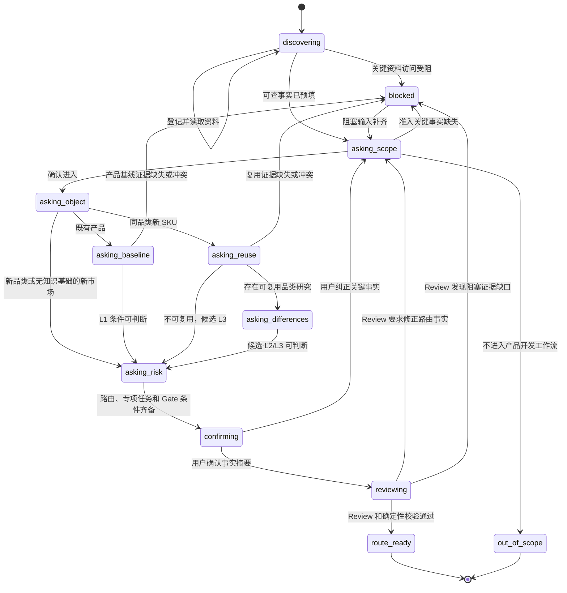

# 项目启动引导式访谈与路由信息补全方案

> 文档状态：当前基线 v1.2（2026-07-22）  
> 适用范围：项目初始信息进入 Gate 1 前的准入与 L1/L2/L3 路由信息补全  
> 事实来源：`00_项目启动卡.md`、`08_流程裁剪判断表.md`、`mvp-1/docs/decisions/ADR-004-product-development-routing-scope.md`、`mvp-1/docs/decisions/ADR-006-intake-route-review-and-artifact-maturity.md`  
> 历史归档：`archives/2026-07-21_项目启动与路由就绪模块_阶段归档.md`（不反向改写）

## 1. 目标

引导式启动访谈只解决一个问题：把零散项目描述补全到足以判断工作流路径的程度。

访谈的最终状态只有三类：

- `route_ready`：能够给出有证据的 L1/L2/L3 建议，没有阻塞路由的缺口，且 AI 路由复核、确定性校验和 reviewed Gate 1 送审包已完成。
- `out_of_scope`：确认不进入智能硬件产品开发工作流，并明确旁路流程。
- `blocked`：关键事实、证据或决策缺失，暂时不能可靠判断路径；已生成输入补齐任务。

访谈不负责提前完成 PRD、产品定义、专项研究或详细验证设计。Gate 1 仍由人工批准、退回、改级、旁路或终止。

## 2. 对 mattpocock/skills 的研究结论

本次研究基于 `mattpocock/skills` 的提交 `9603c1cc8118d08bc1b3bf34cf714f62178dea3b`（2026-07-16）。仓库采用 MIT License，可在保留许可条件下修改和复用。

### 2.1 直接借鉴

| 来源 Skill | 可借鉴模式 | 本方案的落点 |
|---|---|---|
| `grilling` / `grill-me` | 把问题组织为有依赖的决策树；一次只问一个问题；每问附推荐答案；能从环境查到的事实不询问用户 | 互动访谈的问题选择器、问题卡片、事实优先规则 |
| `grill-with-docs` / `domain-modeling` | 在讨论过程中即时沉淀术语与已确认决策，不等到会后凭记忆整理 | 每个答案立即回写访谈会话；稳定结论生成启动卡；重大路由规则才进入 ADR |
| `to-questionnaire` | 当当前用户不掌握事实时，问题应面向真正持有知识的人；优先问影响决策的知识缺口；允许回答“不知道” | `delegated` 答案、输入补齐任务、异步问卷模式 |
| `to-spec` | 访谈结束后基于已经解决的上下文直接合成产物，不重复采访 | `route_ready` 后直接生成项目启动卡和 Gate 1 摘要 |
| `writing-great-skills` | 单一事实来源、渐进披露、明确且可检查的完成条件、避免步骤提前结束 | 路由规则只引用 `08`；问题树与输出契约分离；使用确定性的停止条件 |

### 2.2 选择性借鉴

| 来源 Skill | 选择性使用方式 | 不直接照搬的原因 |
|---|---|---|
| `batch-grill-me` | 仅在用户明确选择异步问卷时，一次发送“当前已解锁的问题前沿”，每批最多 5 个互不依赖的问题 | 互动场景批量提问会增加理解负担，也容易让后续问题建立在未确认答案上 |
| `wizard` | 展示当前阶段、已完成阶段和剩余阶段；每个阶段只呈现当前任务 | 不生成 Bash 向导；本流程需要动态决策树和持久会话状态 |
| `handoff` | 会话暂停时只保存已确认事实、开放缺口、下一问题和源文档引用，避免复制全文 | 项目启动访谈需要业务 Schema，而不是通用交接摘要 |
| `wayfinder` | 仅对跨角色、跨资料、单次访谈无法收敛的复杂路由建立“路由地图”：先固定目的地，再把研究、决策、原型和取数工作做成有阻塞关系的补齐项 | 常规项目没有“迷雾”时应直接完成访谈；不引入 Issue Tracker 作为运行依赖，也不把路由地图变成产品实施计划 |

### 2.3 不纳入本方案

- `tdd`、`code-review`、`diagnosing-bugs` 等工程执行 Skill 不属于启动路由访谈。
- “遍历所有决策分支才结束”不适用于启动阶段。本方案的完成条件是“路由就绪”，不是“完整产品共识”。
- `to-questionnaire`、`batch-grill-me`、`wizard` 当前位于源仓库的 `in-progress` 目录，只借鉴设计模式，不把它们作为运行依赖。
- 不整体安装外部 Skill 集；只把适合本项目的规则写入本地 Skill、Schema 和事实来源。

### 2.4 研究来源

- [仓库说明](https://github.com/mattpocock/skills/blob/9603c1cc8118d08bc1b3bf34cf714f62178dea3b/README.md)
- [grilling](https://github.com/mattpocock/skills/blob/9603c1cc8118d08bc1b3bf34cf714f62178dea3b/skills/productivity/grilling/SKILL.md)
- [batch-grill-me](https://github.com/mattpocock/skills/blob/9603c1cc8118d08bc1b3bf34cf714f62178dea3b/skills/in-progress/batch-grill-me/SKILL.md)
- [to-questionnaire](https://github.com/mattpocock/skills/blob/9603c1cc8118d08bc1b3bf34cf714f62178dea3b/skills/in-progress/to-questionnaire/SKILL.md)
- [domain-modeling](https://github.com/mattpocock/skills/blob/9603c1cc8118d08bc1b3bf34cf714f62178dea3b/skills/engineering/domain-modeling/SKILL.md)
- [to-spec](https://github.com/mattpocock/skills/blob/9603c1cc8118d08bc1b3bf34cf714f62178dea3b/skills/engineering/to-spec/SKILL.md)
- [writing-great-skills](https://github.com/mattpocock/skills/blob/9603c1cc8118d08bc1b3bf34cf714f62178dea3b/skills/productivity/writing-great-skills/SKILL.md)
- [wayfinder](https://github.com/mattpocock/skills/blob/9603c1cc8118d08bc1b3bf34cf714f62178dea3b/skills/engineering/wayfinder/SKILL.md)
- [MIT License](https://github.com/mattpocock/skills/blob/9603c1cc8118d08bc1b3bf34cf714f62178dea3b/LICENSE)

## 3. 核心设计原则

### 3.1 路由就绪，而不是信息完备

每个问题都必须影响以下至少一个输出：

- 是否进入产品开发工作流。
- 产品对象属于既有产品、同品类新 SKU，还是新品类/缺少知识基础的新市场。
- 既有产品或品类知识能否复用。
- 是否存在阻塞路由的证据缺口。
- 需要增加哪些专项研究、验证或 Gate 条件。

如果一个问题只影响 PRD 内容而不影响上述输出，将它登记为后续任务，不在启动访谈中继续追问。

### 3.2 资料接入先于事实发现

有文档或资料时，先完成“资料接入”，再开始路由访谈。产品经理只需上传文件、提供链接或指出系统位置，不需要把资料内容手工抄入启动卡。

1. 创建 `source-manifest`，为每项资料登记稳定 `source_id`、标题、类型、位置、版本或内容哈希、访问状态、敏感级别和读取状态。
2. Agent 在权限允许范围内读取资料，只提取影响准入、产品对象、知识复用、专项任务和风险条件的事实；事实通过 `source_id + 精确位置` 追溯，不在会话中复制全文。
3. 可访问资料完成读取或明确跳过后，`source_discovery_status` 才能进入 `ready`；用户确认没有现成资料时记录 `declared_none`，不把“没有资料”误判为系统遗漏。
4. 无法访问但可能改变路由的资料转为 `access_task`；必要时状态为 `blocked`，不得绕过资料直接重复询问用户其中已经存在的内容。
5. 资料新增、有效版本变化或哈希变化时，提升 `source-manifest` 版本，只重算受影响事实与问题分支。

资料接入不是要求“先编写一份新文档”，而是先把已有材料登记并交给 Agent 读取。原始资料仍保留在其主维护位置；`source-manifest` 只保存索引、版本和处理状态。

### 3.3 事实由 Agent 查，决策由人确认

Agent 应先读取项目简述、有效 PRD、产品规格、历史研究、用户/售后反馈、正式决策和台账。

- 可从资料定位的内容记录为 `fact`，附 `source_ref` 和置信状态。
- 资料冲突时不自行选择，记录 `conflicted` 并询问事实负责人。
- 需要业务取舍、范围确认或风险接受的内容逐项询问用户。
- Agent 的推断只能是 `inferred`，不能伪装为 `confirmed`。

### 3.4 依赖顺序优先

问题选择器每次只选择前置条件已经解决的问题。默认顺序为：

```text
资料接入与版本登记
-> 资料读取与事实预填
-> 工作流准入
-> 产品对象
-> 产品/研究基线
-> 知识复用与差异
-> 候选等级
-> 风险与任务修正
-> 摘要确认
-> AI 路由复核与确定性校验
-> reviewed Gate 1 送审包
-> 独立人工 Gate 1
```

例如，“需要哪些 L2 专项研究”依赖于“这是同品类新 SKU”和“哪些知识只能部分复用”；前置问题未确认时不能提前询问专项研究。

### 3.5 一次只问一个路由变量

互动模式下，每轮只问一个问题并等待回答。一个多选问题可以覆盖同一变量的多个选项，但不能把两个独立决策拼在一起。

每个问题必须包含：

1. 当前已知事实。
2. 一个明确问题。
3. 推荐答案及依据；证据不足时明确写“暂无推荐”。
4. 可选答案或期望回答格式。
5. 该答案对路由的影响。
6. 允许回答“不知道”，并说明不知道后的处理方式。

### 3.6 每次回答后重算，不按固定问卷走到底

用户每回答一次，系统都更新事实、缺口和路由快照，然后重新计算下一问题。已被前一答案剪枝的分支不再询问。

### 3.7 人工 Gate 不被访谈替代

`route_ready` 在新会话契约中表示启动模块已经完成 AI 路由复核、确定性校验和送审版本锁定，不表示路由已批准。Skill 不创建人工 `decision_id`，不把 Review 结果写成批准结果，也不自动编译任务包。

## 4. 会话模式

### 4.1 互动模式（默认）

- 一轮一个问题。
- 适合产品负责人与 Agent 实时协作。
- 用户答复后立即更新会话状态。
- 默认在当前分支达到停止条件后结束。

### 4.2 异步问卷模式

只有用户明确要求异步收集、目标知识持有人不在场或需要跨角色补齐时使用。

- 每轮最多 5 个问题。
- 同一批问题必须属于当前“问题前沿”：彼此没有依赖，且所有前置条件已解决。
- 按对路由的影响从高到低排列。
- 每题只问一个知识点，并提供回答占位、用途说明和“不知道/不确定”选项。
- 回收答案后重新计算问题树，不自动发送下一批。

## 5. 会话状态机



会话必须可暂停和恢复。恢复时先读取 `source-manifest` 与 `intake-session`，展示资料处理状态、已确认事实、未解决缺口和下一问题，不重复询问已经确认且来源版本未变化的内容。

## 6. 路由问题树

### 6.1 A：工作流准入

必须判断：

- 是否需要形成完整或新版智能硬件 PRD。
- 是否新增或改变功能、规格、用户流程、产品边界或方案取舍。
- 是否需要跨产品、研发、设计、测试等角色完成产品判断。
- 是否只是普通修复、整改、等效工程变更或轻量软件变更。
- 若旁路，应进入哪个专业流程。

结果：`in_scope`、`out_of_scope` 或 `blocked`。

### 6.2 B：产品对象

只在 `in_scope` 后判断：

- 既有产品的变更，不创建新 SKU。
- 同品类的新 SKU 或独立型号。
- 新品类。
- 缺少可复用证据的新市场。

产品对象不清楚时，不继续询问风险或详细需求，直接补齐产品对象事实。

### 6.3 C：基线与知识复用

既有产品分支需要：

- 当前有效产品基线或 PRD。
- 定位、市场、核心用户和品类基本不变的证据。
- 本次新增、修改或删除范围能够基于原产品说明。

同品类新 SKU 分支需要：

- 可引用的品类、市场、用户和竞品研究。
- 研究的版本、适用市场和适用时间。
- 与基线产品的差异能够通过有限专项研究补齐。

声称“可复用”但没有证据时，状态为 `blocked`，不能因为经验判断而选择更轻等级。

### 6.4 D：差异范围

差异只按影响路由所需的粒度确认：

- 目标市场。
- 目标用户。
- 核心场景与定位。
- 竞品与价格带。
- 功能与规格。
- 技术与结构方案。
- 商业模式、渠道、安装和售后模式。

若差异仍处于同品类知识边界内且可由有限专项研究补齐，候选 L2；若差异使既有市场、用户、竞品或商业判断无法支撑产品定义，候选 L3。

### 6.5 E：风险与任务修正

候选等级形成后再扫描市场、用户、技术、结构、供应链、制造、认证、安全、投入、交付和售后风险。

- 风险默认生成专项研究、预研、验证、评审或 Gate 条件。
- 风险只有在揭示产品对象变化或知识不可复用时才触发重新路由。
- 单纯工程风险不把旁路事项变成产品开发项目。

### 6.6 F：摘要确认

最后一个互动问题只确认用于 Gate 1 的事实摘要：准入、产品对象、复用资产、关键差异、推荐等级、阻塞项、专项任务和风险条件。

用户纠正任何会改变路由的事实时，返回对应分支；非路由信息记录为后续任务，不重新打开已关闭分支。

## 7. 问题卡片格式

```text
当前进度：产品对象（3/6）

已知事实：现有资料显示本项目会创建独立型号，但沿用无线链式开窗机品类研究。

问题：这个项目是否会形成可独立销售、报价或维护的新 SKU？

建议答案：是。
依据：项目简述出现独立型号与单独价格带；尚未发现仅为原型号版本升级的证据。

可选回答：
A. 是，新 SKU/独立型号
B. 否，是既有 SKU 的产品变更
C. 尚未决定

对路由的影响：A 进入 L2/L3 知识复用判断；B 进入 L1 基线判断；C 将产品对象标记为阻塞项。
```

推荐答案必须引用已知证据。没有足够证据时写“暂无推荐，请确认”，不能用推荐答案诱导用户替 Agent 补造事实。

## 8. 不知道、冲突与转交

### 8.1 用户回答“不知道”

系统继续询问三个补充项，但仍一次一个问题：

1. 谁最可能知道。
2. 可从哪个文档、数据或系统获得。
3. 何时需要获得。

然后生成输入缺口：`owner`、`expected_source`、`due_at`、`blocking` 和 `next_action`。

### 8.2 资料与口头答案冲突

- 保留两个来源，不覆盖原记录。
- 将事实标记为 `conflicted`。
- 向有决策权或事实所有权的人确认。
- 冲突影响准入、产品对象或知识复用时，状态为 `blocked`。

### 8.3 非阻塞未知项

如果未知项只影响 PRD细节、研究执行方式或后续验证，不影响路径，则记录为 `non_blocking_gap` 并继续完成路由。

### 8.4 复杂路由的轻量 Wayfinder 模式

当一个阻塞项背后还包含多项跨角色研究或决策，且预计无法在一次访谈中解决时，将当前会话升级为“路由地图”。地图的目的地固定为：

> 形成一份证据充分、可送 Gate 1 的准入与 L1/L2/L3 路由建议。

路由地图只包含走到该目的地前必须解决的事项，不包含 PRD、研发实施或产品上市工作。

| Wayfinder 概念 | 本项目本地化 |
|---|---|
| Destination | Gate 1 路由建议就绪 |
| Map | `intake-session` 的缺口、依赖、已确认结论和待细化问题索引 |
| Decision ticket | 影响准入、产品对象、知识复用或风险处理的单一问题 |
| Research（AFK） | Agent 可独立读取 PRD、研究、数据或外部规范以补齐的事实 |
| Grilling（HITL） | 必须由产品负责人或业务决策人回答的取舍 |
| Prototype（HITL） | 只有通过低成本技术/体验原型才能判断知识是否可复用或产品对象是否变化的事项 |
| Task（AFK/HITL） | 获取权限、导出数据、找到正式版本等为决策提供输入的动作 |
| Frontier | 所有前置缺口已关闭、现在可以处理的开放项 |
| Fog of war | 已知会影响路由，但目前还不能准确表述成单一问题的区域 |
| Out of scope | 已确认属于 PRD、实施或其他专业流程的内容 |

使用规则：

1. 先写目的地，再创建补齐项。
2. 每个补齐项只解决一个问题，并标记 `gap_type`、`interaction` 和 `depends_on`。
3. 只处理当前前沿；下游问题等待依赖关闭。
4. 能准确表述的问题立即成为补齐项；暂时无法准确表述的保留在 `not_yet_specified`，不预造问题。
5. 一个结论只保存在对应补齐项中，地图只保存摘要和引用。
6. 若首次扫描没有迷雾，也没有跨会话依赖，不创建路由地图，继续普通单题访谈。
7. 地图清空后回到摘要确认，再由 `pmflow-project-intake` 内部的独立 reviewer pass 复核，不直接进入人工 Gate 或实施。

## 9. 路由判定与停止条件

### 9.1 L1 路由就绪

同时满足：

- `in_scope`。
- 既有产品，不创建新 SKU。
- 存在有效产品基线或 PRD。
- 定位、目标市场和核心用户基本可复用。
- 本次变更需要产品取舍并可在原产品基础上描述。
- 阻塞路由的缺口为空。

### 9.2 L2 路由就绪

同时满足：

- `in_scope`。
- 同品类新 SKU。
- 存在可引用的品类研究。
- 关键差异已识别。
- 差异可通过有限专项研究补齐。
- 阻塞路由的缺口为空。

### 9.3 L3 路由就绪

满足任一产品条件且有证据：

- 新品类。
- 缺少可复用证据的新市场。
- 既有品类研究无法支持目标用户、场景、竞争或商业判断。

同时必须说明需要从头补齐的研究链。L3 可以存在研究缺口，但不能缺少“为什么现有知识不可复用”的路由证据。

### 9.4 `out_of_scope` 就绪

- 不改变产品定义或不需要完整/新版智能硬件 PRD。
- 已明确旁路流程和接收角色。
- 若未来触发产品定义变化，已记录重新进入条件。

### 9.5 `blocked` 就绪

- 已明确阻塞变量和冲突。
- 每个阻塞项都有责任人或预期来源、下一步和所阻塞的路由分支。
- 系统不继续询问依赖于该阻塞变量的下游问题。

## 10. 结构化输出

资料接入时先更新 `source-manifest`，字段契约见 `mvp-1/workflow/contracts/source-manifest.schema.json`；每次资料读取或回答后再更新 `intake-session`，字段契约见 `mvp-1/workflow/contracts/intake-session.schema.json`。Schema 检查字段形状；`mvp-1/src/pmflow/validators/intake.py` 进一步确定性检查资料读取前置条件、互动模式待答问题数、终态不变量、开放阻塞项与缺口依赖环。

核心对象包括：

| 对象 | 作用 |
|---|---|
| `source-manifest` | 资料索引、位置、版本/哈希、权限、敏感级别、读取状态和所提取事实，不保存不必要的全文副本 |
| `facts` | 已确认、推断、未知或冲突的事实，带来源和路由影响 |
| `questions` | 已问、待问、转交或跳过的问题及答案 |
| `gaps` | 阻塞与非阻塞输入缺口、类型、HITL/AFK、依赖、责任人和下一步 |
| `route_snapshot` | 当前准入、产品对象、知识复用、候选等级和 Gate 就绪状态 |
| `route_review` | Review ID、被复核输入版本、等级、结论、阻塞 findings 和 Gate 包就绪状态 |
| `not_yet_specified` | 已知在目的地方向上但尚不能准确表述的问题 |
| `out_of_scope_notes` | 已确认不属于本次路由目的地的内容 |

访谈结束后生成：

1. `00_项目启动卡.md` 的项目实例。
2. Gate 1 简报，不包含人工批准结果。
3. 若 `blocked`，生成输入补齐任务。
4. 若 `out_of_scope`，生成旁路交接摘要。
5. 若候选路由可审，先在启动模块内生成 AI 路由 Review，再将启动卡、Gate 简报和 Review 定格为 `reviewed`。
6. 生成符合 `route-gate-request.schema.json` 的 Gate 1 请求，锁定产物 ID、版本、哈希、Review ID、输入版本和幂等键。

## 11. Skill 分工

```text
pmflow-project-intake
  Executor：登记资料、读取事实、逐问补齐、生成路由草案
  Reviewer：对照 08 复核准入、知识复用、路由和风险
  Validator：检查 Schema、状态与版本不变量
  Output：reviewed Gate 包 + route-gate-request
        |
        v
Human Gate 1
  批准、退回、改级、旁路或终止
        |
        v
pmflow-compile-tasks
  仅在有效人工决策后编译任务包
```

`pmflow-project-intake` 不自行批准路由；独立的 `pmflow-route` 仅作为历史兼容入口，新流程不编排它；`pmflow-compile-tasks` 不接受只有 AI 建议而没有人工决策的输入。

## 12. 验收标准

方案实现满足以下条件才算完成：

- 同一输入下，问题顺序由依赖关系和阻塞程度决定，不由随机主题切换决定。
- 互动模式每次只输出一个问题。
- 每个问题都有问题 ID、目标变量、推荐答案/暂无推荐、理由和路由影响。
- 有资料时先形成可审计的 `source-manifest`；无资料时显式记录 `declared_none`。
- 用户只需提供文件、链接或系统位置，不需要把资料内容抄入启动卡。
- 资料发现未完成时不开始路由提问；访问受阻的关键资料会转为结构化缺口。
- 已有资料中的事实不会再次向用户索取。
- “不知道”能够转为结构化输入缺口，而不是被 AI 猜测填充。
- 任意时刻可以从会话状态恢复，不重复已确认问题。
- `route_ready`、`blocked`、`out_of_scope` 的停止条件可由 Schema 和规则校验。
- `route_ready` 包含匹配当前输入版本与候选等级的 AI 路由 Review，且无阻塞 findings。
- Gate 1 只接收带 ID、版本和哈希的 `reviewed` 启动卡、Gate 简报和 Review。
- 启动卡输出包含证据、缺口、专项任务和重新路由条件。
- Gate 1 前不生成批准结论，不编译正式任务包。
- 不进入 PRD 详细需求、交互、异常状态和验证用例访谈。

## 13. 归档后的重新开启顺序

以下事项属于后续阶段，不影响方案与契约初版归档：

1. 使用一个符合新定义的真实 L1 产品变更做前向测试。
2. 验证 `reviewing -> route_ready` 的 Review、校验和送审包条件是否过早或过重。
3. 再使用一个 L2 新 SKU 和一个旁路工程变更验证分支剪枝。
4. 根据实际访谈记录调整问题优先级，而不是增加固定问题数量。
5. 最后再把会话状态、问题卡片和 Gate 1 接入飞书工作台。
