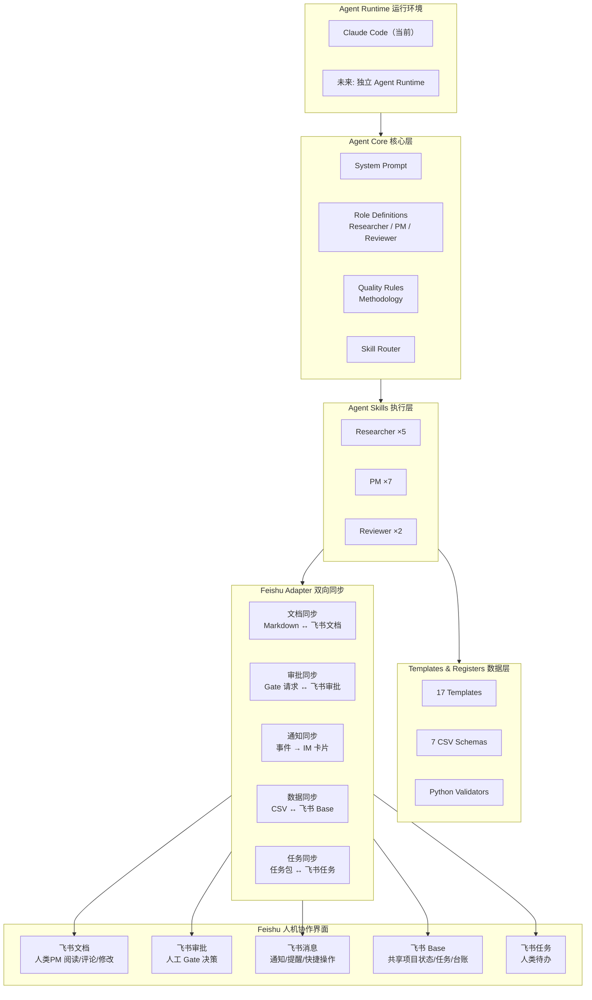
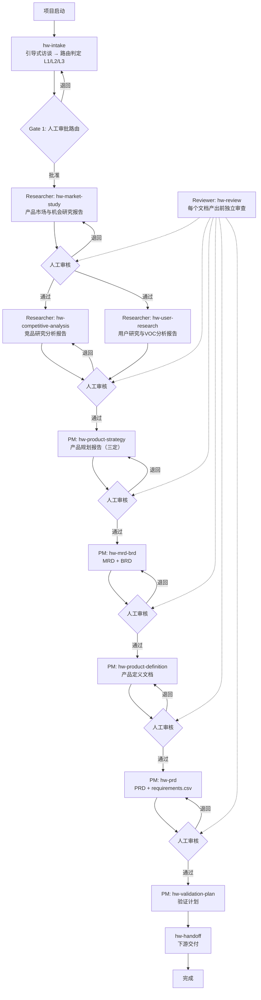
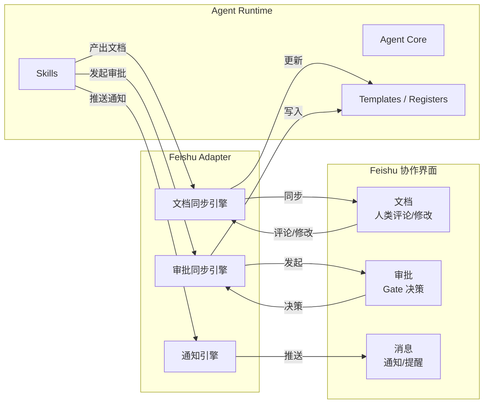

# 智能硬件 PM Agent — 完整实施方案

> 版本：v1.1
> 日期：2026-07-30
> 状态：设计定案，待实施

---

## 一、整体架构

### 1.1 模块化设计



### 1.2 飞书的定位：人机协作界面，不是 Runtime

飞书不是 Agent 的替代运行环境。Claude Code（以及未来的独立 Agent Runtime）才是 Agent 运行的地方。

飞书的角色是 **AI 与人类 PM 之间的双向协作界面**：

| 能力 | 方向 | 场景 |
|------|------|------|
| **飞书文档** | AI → 人 → AI | AI 写完报告同步到飞书文档 → 人类 PM 阅读、评论、直接修改 → AI 读取反馈后继续工作 |
| **飞书审批** | AI → 人 → AI | AI 完成阶段产出 → 发起 Gate 审批请求 → 人类 PM 批准/退回/有条件批准 → AI 接收决策写入 decisions.csv |
| **飞书消息** | AI → 人 | Reviewer 发现 blocker → 推送 IM 卡片给 PM；Gate 审批请求 → 通知审批人；任务逾期 → 发送提醒 |
| **飞书 Base** | AI ↔ 人 | 项目状态、任务清单、台账数据在 Base 和本地 CSV 之间双向同步，人和 AI 都可见可操作 |
| **飞书任务** | AI → 人 | AI 拆解的任务包同步为人类 PM 的飞书个人待办，带截止时间和依赖关系 |

### 1.3 关键交互流程

#### 文档协作流

```
AI 完成研究 → 同步到飞书文档（草稿状态）
  → 人类 PM 在飞书中阅读、评论、修改
  → AI 检测到飞书文档更新 → 拉取变更
  → AI 合并人类修改（人类修改优先）
  → 更新本地 Markdown → 继续下一步
```

#### Gate 审批流

```
AI 完成阶段 → 生成 Gate 摘要 → 同步到飞书文档
  → AI 发起飞书审批（附带文档链接 + 决策选项）
  → 人类 PM 在飞书中审批（批准/退回/有条件批准）
  → AI 收到审批结果 → 写入 decisions.csv
  → 批准 → 进入下一阶段
  → 退回 → 根据退回原因修正 → 重新提交
```

#### 通知流

```
Reviewer 发现 blocker finding
  → AI 生成 IM 卡片（含 finding 摘要 + 飞书文档链接）
  → 推送给 PM
  → PM 点击卡片直达文档 → 处理问题
```

### 1.4 模块接口

| 模块 | 输入 | 输出 | 依赖 |
|------|------|------|------|
| **Agent Core** | 项目方法论 | System Prompt、角色定义、质量规则、技能路由表 | 无 |
| **Agent Skills** | Agent Core + Templates + Registers | 研究报告、产品文档、台账记录 | Agent Core, Data |
| **Data** | 模板包 | Markdown 模板、CSV Schema、校验脚本 | 无 |
| **Feishu Adapter** | Agent 产出 + 飞书事件 | 同步内容 + 人类反馈 | Agent Skills, 飞书 API |
| **Feishu 界面** | AI 推送 | 人类评论/修改/审批决策 | 无 |

### 1.5 关键设计原则

1. **Agent 是核心，飞书是界面**：Agent 不依赖飞书运行（Phase 1-2 纯本地），飞书接入后 Agent 逻辑不变
2. **双向同步，不是单向发布**：AI 推送文档到飞书，人类在飞书中修改后 AI 拉回更新
3. **人类修改优先**：当本地版本和飞书版本冲突时，人类在飞书中的修改为准（人类是最终决策者）
4. **审批是飞书原生能力**：不自己实现审批流，使用飞书审批作为 Gate 机制
5. **通知驱动行动**：AI 主动推送审批请求和 blocker 通知，人类不用轮询检查

---

## 二、完整流程（串行 + 人工门径）



**关键规则**：
- 路由判定在项目启动时完成，不在研究之后
- 每个文档产出前必须经过 Reviewer 审核 + 人类 PM 审批
- 报告之间有输入输出依赖（对齐 00A 文档关系）
- 人类 PM 是门径的最终守门员

---

## 三、Researcher 研究领域

| 领域 | 产出 | 说明 |
|------|------|------|
| **市场研究** | 产品市场与机会研究报告 | 五看（行业/客户/竞争/自身/机会），含技术趋势和产业链分析 |
| **用户研究** | 用户研究与VOC分析报告 | 多角色链（安装工/使用者/决策者/维护者）、JTBD、用户旅程、痛点优先级 |
| **竞品分析** | 竞品研究分析报告 | 桌面数据、拆机、BOM反推、体验对标、供应链追溯 |
| **合规研究** | 产品合规研究报告 | 目标市场→标准→认证路径→周期→费用；按 L1/L2/L3 分级 |
| **专利分析** | 专利格局分析报告 | 专利地图、阻塞风险、空白区域；格局分析，不做法律判断 |

**技术可行性评估不属于 Researcher 范围**——那是 PRD 输出后，开发团队基于具体方案做的工程判断。

---

## 四、Skills 完整清单（16 个）

### 4.1 Researcher Skills（5 个）

| # | Skill | 输入 | 输出 | 写入台账 |
|---|-------|------|------|---------|
| R1 | `hw-market-study` | 项目启动卡、行业线索 | 产品市场与机会研究报告（含摘要 + 输入来源表） | evidence.csv, assumptions.csv |
| R2 | `hw-user-research` | 市场研究的候选用户人群、VOC 线索 | 用户研究与VOC分析报告（含摘要 + 输入来源表） | evidence.csv, assumptions.csv |
| R3 | `hw-competitive-analysis` | 市场研究的核心竞品清单 | 竞品研究分析报告（含摘要 + 输入来源表） | evidence.csv, assumptions.csv |
| R4 | `hw-compliance-research` | 目标市场、产品类型 | 产品合规研究报告（含摘要 + 输入来源表） | evidence.csv, assumptions.csv |
| R5 | `hw-patent-analysis` | 关键技术领域、竞品清单 | 专利格局分析报告（含摘要 + 输入来源表） | evidence.csv, assumptions.csv |

### 4.2 PM Skills（7 个）

| # | Skill | 输入 | 输出 | 写入台账 |
|---|-------|------|------|---------|
| P1 | `hw-intake` | 项目资料 + source-manifest | 启动卡 + 路由判定(L1/L2/L3) + Gate 1 简报 + 任务包 | decisions.csv（Gate 1 后） |
| P2 | `hw-product-strategy` | 所有已批准研究 + evidence | 产品规划报告（三定+MVP+路线图） | decisions.csv |
| P3 | `hw-mrd-brd` | 产品规划报告 | MRD + BRD（L2 用合并版，L3 分别输出） | — |
| P4 | `hw-product-definition` | 产品规划 + MRD/BRD | 产品定义文档（定位/JTBD/MVP/边界） | — |
| P5 | `hw-prd` | 产品定义 + 约束 | PRD + requirements.csv | requirements.csv, traceability.csv |
| P6 | `hw-validation-plan` | PRD + 假设 + 风险 | 验证计划 | traceability.csv（更新） |
| P7 | `hw-gate-prep` | 各阶段产物 + Reviewer findings | Gate 摘要 + 飞书审批请求 | decisions.csv（人工确认后） |

### 4.3 Reviewer Skills（2 个）

| # | Skill | 输入 | 输出 | 写入台账 |
|---|-------|------|------|---------|
| V1 | `hw-review` | Researcher 报告 或 PM 文档 + 台账 | findings（带 severity + required_action） | risks.csv（如发现新风险） |
| V2 | `hw-red-team` | PRD + 产品定义 + 假设 | 杀伤性假设 + 最便宜验证方案 | assumptions.csv（如发现新假设） |

### 4.4 补充技能（2 个）

| # | Skill | 输入 | 输出 | 写入台账 |
|---|-------|------|------|---------|
| S1 | `hw-retro` | 验证结果 + 阶段评审 + 上市反馈 | 项目复盘报告 | method_learnings.csv |
| S2 | `hw-handoff` | 已批准产物 + 团队映射 | 下游交付包（按硬件/固件/APP/测试/质量/供应链/售后拆包） | — |

**总计：16 个 Skills**

---

## 五、Agent 通信协议

### 5.1 Researcher → PM 的契约

```yaml
research-delivery:
  artifact_id: "ART-{project}-{seq}"
  artifact_type: "market_study | user_research | competitive_analysis | compliance | patent"
  report_path: "path/to/report.md"
  summary: "<500字摘要>"
  evidence_ids: ["EV-001", "EV-002"]
  assumption_ids: ["A-001"]
  open_questions:
    - question: "目标市场选择A还是B？"
      impacted_decisions: ["产品定位", "认证路径"]
  maturity: "reviewed"
```

### 5.2 PM → Reviewer 的契约

```yaml
review-request:
  artifact_id: "ART-{project}-{seq}"
  artifact_type: "product_strategy | mrd | brd | product_definition | prd | validation_plan"
  artifact_path: "path/to/document.md"
  artifact_version: "v0.1"
  input_artifacts:
    - artifact_id: "ART-001"
      version: "v1.0"
  maturity: "draft"
```

### 5.3 Reviewer → PM 的契约

```yaml
review-result:
  review_id: "REV-{project}-{seq}"
  artifact_id: "ART-{project}-{seq}"
  verdict: "approved | conditional | rejected"
  findings:
    - finding_id: "F-001"
      severity: "blocker | high | medium | low"
      category: "evidence | scope | requirement | acceptance | validation | risk | consistency"
      location: "章节或对象ID"
      finding: "具体问题描述"
      required_action: "must_fix | suggest | submit_decision"
```

---

## 六、输出格式

### 6.1 研究报告结构

```markdown
# 报告标题

## 摘要（≤500字）
- 对路由有影响的发现
- 对产品定义有约束的发现
- 需要 PM 决策的开放问题

## 方法说明
...

## 正文（详细分析）
...

## 输入来源表（对齐 00A 3A 节）
| 输入项 | 状态 | 来源/证据 | 影响 | 处理方式 |
...
```

### 6.2 CSV 台账规则

- **索引唯一**：ID 格式 `{type}-{project}-{seq}`
- **数据可信**：每条记录标记 source + quality_level + confidence
- **数据完整**：关键结论必须登记，缺失输入标记为 gap
- **CSV 是权威**：报告和 CSV 冲突时，以 CSV 为准

---

## 七、台账机制

### 7.1 写入规则

| 台账 | 写入者 | 触发时机 |
|------|--------|---------|
| evidence.csv | Researcher | 发现关键事实时**立即**写入 |
| assumptions.csv | Researcher + PM | Researcher 标记未验证判断；PM 标记新假设 |
| risks.csv | PM + Reviewer | 发现风险时写入 |
| requirements.csv | PM（PRD） | PRD 编写时**同步**写入 |
| traceability.csv | PM | 建立证据→需求关联时**增量**追加 |
| decisions.csv | PM（Gate Prep） | Gate 审批后**人工确认**后写入 |
| method_learnings.csv | PM（复盘） | 项目复盘后写入 |

### 7.2 确定性校验规则（8 条）

| 规则 | 检查内容 | 严重级别 |
|------|---------|---------|
| V-01 | 每条 P0/P1 requirement 有 ≥1 条 traceability | blocker |
| V-02 | traceability 中引用的 evidence_id 存在 | blocker |
| V-03 | traceability 中引用的 requirement_id 存在 | blocker |
| V-04 | assumptions 中 confidence=高 但没有 validation_method | high |
| V-05 | risks 中 impact=高 但没有 mitigation | blocker |
| V-06 | evidence 的 quality_level 不为空 | medium |
| V-07 | ID 格式符合规范，无跨文件重复 | blocker |
| V-08 | 已批准 artifact 有关联 decision_id | blocker |

---

## 八、跨项目学习机制

新项目启动时，自动检索 method_learnings.csv 中匹配的记录：

- 匹配规则：`applies_to` 字段包含当前项目的品类/技术/市场关键词
- 仅提取共性或关联的经验教训
- 加载到当前会话上下文，PM Agent 在 Gate 准备时检查是否重复了已知错误

---

## 九、Phase 3 飞书集成架构

### 9.1 集成概览

Phase 1-2 不依赖飞书，Agent 在 Claude Code 中纯本地运行。

Phase 3 增加 Feishu Adapter 层，将 Agent 产出同步到飞书，同时接收人类的反馈。



### 9.2 集成任务

| 任务 | 产出 | 说明 |
|------|------|------|
| 文档双向同步 | Markdown ↔ 飞书文档 | AI 同步到飞书 → 人类评论/修改 → AI 拉回更新。冲突时人类修改优先 |
| 审批集成 | Gate → 飞书审批 | AI 准备 Gate 摘要 → 发起审批 → 人类决策 → 回写 decisions.csv |
| IM 通知 | 事件 → 消息卡片 | Reviewer blocker、Gate 审批请求、任务逾期 → 推送给对应 PM |
| Base 共享 | CSV ↔ Base 表 | 项目状态、任务清单、台账在 Base 中人类可查看/编辑 |
| 任务同步 | 任务包 → 飞书任务 | AI 拆解的任务自动生成人类 PM 的飞书待办 |

### 9.3 同步冲突处理

| 场景 | 处理规则 |
|------|---------|
| 人类在飞书中修改了 AI 生成的报告 | 人类修改优先，AI 拉回后合并到本地 Markdown |
| AI 重新生成报告时飞书有未同步的人类修改 | 停止覆盖，通知 PM 存在冲突，等待人工处理 |
| 人类审批退回 | AI 读取退回原因 → 修正 → 重新发起审批 |
| 台账在 Base 和 CSV 中不一致 | CSV 为权威，Base 是快照。同步方向在 manifest 中声明 |

---

## 十、实施阶段

### Phase 0：基础搭建（~2-3 天）

| 任务 | 产出 |
|------|------|
| 0.1 目录结构初始化 | 标准目录树 |
| 0.2 AGENTS.md 编写 | Agent System Prompt |
| 0.3 迁移 mvp-1 资产 | JSON Schema + Python 校验脚本 |
| 0.4 模板更新 | 研究报告模板增加"摘要"章节；新增合规研究和专利分析报告模板 |
| 0.5 Skill 编写范式文档 | SKILL_TEMPLATE.md |

### Phase 1：MVP — L1 本地闭环（~1-2 周）

**目标**：Claude Code 内跑通 L1 项目完整流程。**不涉及飞书**。

| 任务 | 产出 | 依赖 |
|------|------|------|
| 1.1 编写核心 Skills（8 个） | hw-intake, hw-market-study, hw-competitive-analysis, hw-user-research, hw-prd, hw-validation-plan, hw-review, hw-gate-prep | Phase 0 |
| 1.2 端到端 L1 测试 | 用真实 L1 样例跑通完整流程 | 任务 1.1 |
| 1.3 Reviewer 集成 | hw-review 作为子代理独立审查 | 任务 1.1 |
| 1.4 台账端到端验证 | evidence → traceability → requirements 完整链路 | 任务 1.2 |

### Phase 2：L2 + 完整 Skills（~2 周）

| 任务 | 产出 | 依赖 |
|------|------|------|
| 2.1 补齐剩余 Skills（8 个） | hw-compliance-research, hw-patent-analysis, hw-product-strategy, hw-mrd-brd, hw-product-definition, hw-red-team, hw-retro, hw-handoff | Phase 1 |
| 2.2 L2 流程验证 | 用真实 L2 项目跑通 | 任务 2.1 |
| 2.3 跨项目学习 | method_learnings 检索 + 自动加载 | 任务 2.1 |
| 2.4 任务包自动生成 | hw-intake 输出中增加任务清单 | 任务 2.1 |

### Phase 3：飞书协作界面接入（~2-3 周）

**目标**：增加 Feishu Adapter，Agent 产出同步到飞书，人类通过飞书与 AI 协作。

| 任务 | 产出 |
|------|------|
| 3.1 文档双向同步 | Markdown ↔ 飞书文档（含评论/修改同步） |
| 3.2 审批集成 | Gate → 飞书审批（AI 发起，人类决策，回写 decisions.csv） |
| 3.3 IM 通知 | Reviewer blocker、Gate 审批请求、逾期提醒的消息卡片 |
| 3.4 Base 共享 | 项目状态/任务/台账在 Base 中可视化 |
| 3.5 任务同步 | 任务包 → 飞书任务（人类待办） |

### Phase 4：L3 + 生产化（按需）

| 任务 | 说明 |
|------|------|
| 4.1 L3 完整流程 | 全部 11 份文档的端到端验证 |
| 4.2 多项目并行管理 | Base 项目总览、风险仪表盘 |
| 4.3 运行指标 | 效率/质量/决策/交付/Agent 指标 |
| 4.4 独立应用封装 | 从 Claude Code 完全解耦，独立部署 |

---

## 十一、目录结构

```
产品经理文档模版/
│
├── README.md                          # 总体说明（已有）
├── AGENTS.md                          # Agent System Prompt [Phase 0]
├── HANDOFF.md                         # 会话交接（已有）
│
├── templates/                         # 模板 [已有，Phase 0 微调]
│   ├── 00_项目启动卡.md  ~  14_产品规划报告.md
│   ├── 00A_文档关系与追踪说明.md
│   └── 17_产品合规研究报告.md, 18_专利格局分析报告.md [Phase 2]
│
├── registers/                         # 台账 [已有]
│   └── 7 CSV 文件
│
├── skills/                            # Agent Skills [Phase 1-2]
│   ├── SKILL_TEMPLATE.md
│   ├── researcher/（5 Skills）
│   ├── pm/（7 Skills）
│   ├── reviewer/（2 Skills）
│   └── shared/（2 Skills）
│
├── validators/                        # 确定性校验 [Phase 0]
│   ├── schemas/（JSON Schema）
│   └── scripts/（Python）
│
├── adapters/
│   └── feishu/                        # Feishu Adapter [Phase 3]
│       ├── doc-sync.md               # 文档同步契约
│       ├── approval-sync.md          # 审批同步契约
│       ├── notification-spec.md      # 通知规范
│       └── conflict-resolution.md    # 冲突处理规则
│
├── docs/                              # 设计文档
│   ├── architecture.md               # 本方案
│   ├── 15_AI产品经理工作流_方案A详细设计.md
│   └── 16_项目启动引导式访谈与路由信息补全方案.md
│
└── .claude/                           # Claude Code 配置
    ├── settings.local.json
    └── commands/
```

---

## 十二、关键风险

| 风险 | 影响 | 缓解措施 |
|------|------|---------|
| Skills 在 Claude Code 中的可靠性 | Agent 行为不稳定 | 每个 Skill 有可检查的完成条件；Reviewer 独立验证 |
| 上下文窗口不足 | 长报告超出上下文限制 | 摘要章节设计；PM Agent 先读摘要再按需回查原文 |
| 文档双向同步冲突 | 人类和 AI 同时修改 | 人类修改优先；冲突时停止覆盖通知 PM |
| 台账数据漂移 | CSV 和报告不一致 | 确定性校验在 Gate 前强制运行；CSV 是权威 |
| Feishu 集成复杂度 | Phase 3 延期 | Feishu Adapter 隔离在独立模块，不阻塞 Phase 1-2 |
