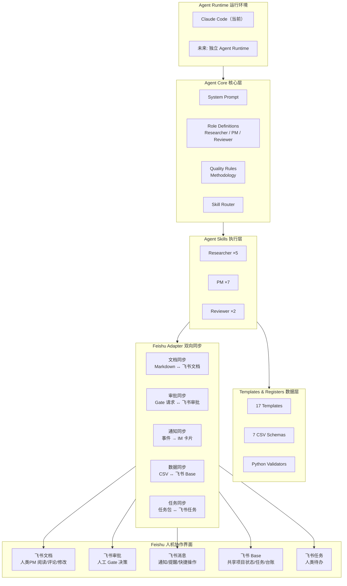
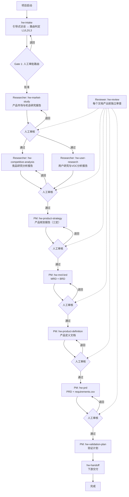
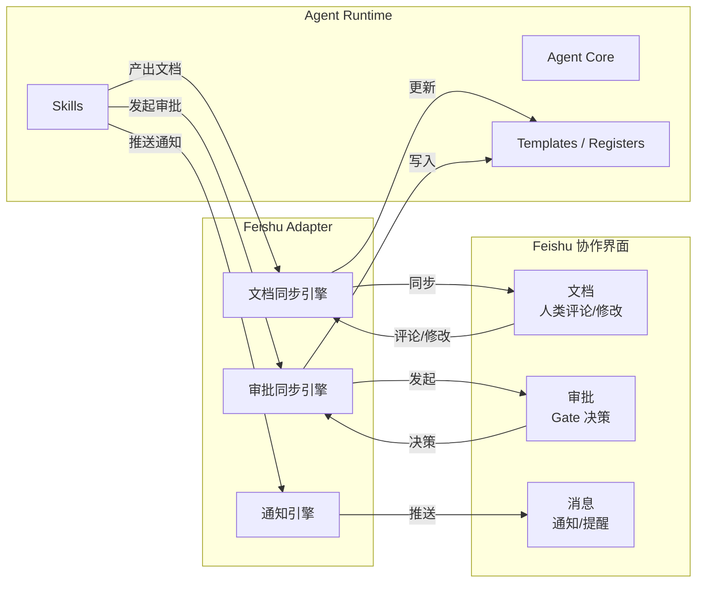

# 智能硬件 PM Agent — 完整实施方案

> 版本：v1.2
> 日期：2026-07-30
> 状态：设计定案，待实施（补充 pm-skills 方法论审计与工具集成）

---

## 一、整体架构

### 1.1 模块化设计



### 1.2 飞书的定位：人机协作界面，不是 Runtime

飞书不是 Agent 的替代运行环境。Claude Code（以及未来的独立 Agent Runtime）才是 Agent 运行的地方。

飞书的角色是 **AI 与人类 PM 之间的双向协作界面**：

| 能力 | 方向 | 场景 |
|------|------|------|
| **飞书文档** | AI → 人 → AI | AI 写完报告同步到飞书文档 → 人类 PM 阅读、评论、直接修改 → AI 读取反馈后继续工作 |
| **飞书审批** | AI → 人 → AI | AI 完成阶段产出 → 发起 Gate 审批请求 → 人类 PM 批准/退回/有条件批准 → AI 接收决策写入 decisions.csv |
| **飞书消息** | AI → 人 | Reviewer 发现 blocker → 推送 IM 卡片给 PM；Gate 审批请求 → 通知审批人；任务逾期 → 发送提醒 |
| **飞书 Base** | AI ↔ 人 | 项目状态、任务清单、台账数据在 Base 和本地 CSV 之间双向同步，人和 AI 都可见可操作 |
| **飞书任务** | AI → 人 | AI 拆解的任务包同步为人类 PM 的飞书个人待办，带截止时间和依赖关系 |

### 1.3 关键交互流程

#### 文档协作流

```
AI 完成研究 → 同步到飞书文档（草稿状态）
  → 人类 PM 在飞书中阅读、评论、修改
  → AI 检测到飞书文档更新 → 拉取变更
  → AI 合并人类修改（人类修改优先）
  → 更新本地 Markdown → 继续下一步
```

#### Gate 审批流

```
AI 完成阶段 → 生成 Gate 摘要 → 同步到飞书文档
  → AI 发起飞书审批（附带文档链接 + 决策选项）
  → 人类 PM 在飞书中审批（批准/退回/有条件批准）
  → AI 收到审批结果 → 写入 decisions.csv
  → 批准 → 进入下一阶段
  → 退回 → 根据退回原因修正 → 重新提交
```

#### 通知流

```
Reviewer 发现 blocker finding
  → AI 生成 IM 卡片（含 finding 摘要 + 飞书文档链接）
  → 推送给 PM
  → PM 点击卡片直达文档 → 处理问题
```

### 1.4 模块接口

| 模块 | 输入 | 输出 | 依赖 |
|------|------|------|------|
| **Agent Core** | 项目方法论 | System Prompt、角色定义、质量规则、技能路由表 | 无 |
| **Agent Skills** | Agent Core + Templates + Registers | 研究报告、产品文档、台账记录 | Agent Core, Data |
| **Data** | 模板包 | Markdown 模板、CSV Schema、校验脚本 | 无 |
| **Feishu Adapter** | Agent 产出 + 飞书事件 | 同步内容 + 人类反馈 | Agent Skills, 飞书 API |
| **Feishu 界面** | AI 推送 | 人类评论/修改/审批决策 | 无 |

### 1.5 关键设计原则

1. **Agent 是核心，飞书是界面**：Agent 不依赖飞书运行（Phase 1-2 纯本地），飞书接入后 Agent 逻辑不变
2. **双向同步，不是单向发布**：AI 推送文档到飞书，人类在飞书中修改后 AI 拉回更新
3. **人类修改优先**：当本地版本和飞书版本冲突时，人类在飞书中的修改为准（人类是最终决策者）
4. **审批是飞书原生能力**：不自己实现审批流，使用飞书审批作为 Gate 机制
5. **通知驱动行动**：AI 主动推送审批请求和 blocker 通知，人类不用轮询检查

---

## 二、完整流程（串行 + 人工门径）



**关键规则**：
- 路由判定在项目启动时完成，不在研究之后
- 每个文档产出前必须经过 Reviewer 审核 + 人类 PM 审批
- 报告之间有输入输出依赖（对齐 00A 文档关系）
- 人类 PM 是门径的最终守门员

---

## 三、Researcher 研究领域

| 领域 | 产出 | 说明 |
|------|------|------|
| **市场研究** | 产品市场与机会研究报告 | 五看（行业/客户/竞争/自身/机会），含技术趋势和产业链分析 |
| **用户研究** | 用户研究与VOC分析报告 | 多角色链（安装工/使用者/决策者/维护者）、JTBD、用户旅程、痛点优先级 |
| **竞品分析** | 竞品研究分析报告 | 桌面数据、拆机、BOM反推、体验对标、供应链追溯 |
| **合规研究** | 产品合规研究报告 | 目标市场→标准→认证路径→周期→费用；按 L1/L2/L3 分级 |
| **专利分析** | 专利格局分析报告 | 专利地图、阻塞风险、空白区域；格局分析，不做法律判断 |

**技术可行性评估不属于 Researcher 范围**——那是 PRD 输出后，开发团队基于具体方案做的工程判断。

---

## 四、Skills 完整清单（16 个）

### 4.1 Researcher Skills（5 个）

| # | Skill | 输入 | 输出 | 写入台账 |
|---|-------|------|------|---------|
| R1 | `hw-market-study` | 项目启动卡、行业线索 | 产品市场与机会研究报告（含摘要 + 输入来源表） | evidence.csv, assumptions.csv |
| R2 | `hw-user-research` | 市场研究的候选用户人群、VOC 线索 | 用户研究与VOC分析报告（含摘要 + 输入来源表） | evidence.csv, assumptions.csv |
| R3 | `hw-competitive-analysis` | 市场研究的核心竞品清单 | 竞品研究分析报告（含摘要 + 输入来源表） | evidence.csv, assumptions.csv |
| R4 | `hw-compliance-research` | 目标市场、产品类型 | 产品合规研究报告（含摘要 + 输入来源表） | evidence.csv, assumptions.csv |
| R5 | `hw-patent-analysis` | 关键技术领域、竞品清单 | 专利格局分析报告（含摘要 + 输入来源表） | evidence.csv, assumptions.csv |

### 4.2 PM Skills（7 个）

| # | Skill | 输入 | 输出 | 写入台账 |
|---|-------|------|------|---------|
| P1 | `hw-intake` | 项目资料 + source-manifest | 启动卡 + 路由判定(L1/L2/L3) + Gate 1 简报 + 任务包 | decisions.csv（Gate 1 后） |
| P2 | `hw-product-strategy` | 所有已批准研究 + evidence | 产品规划报告（三定+MVP+路线图） | decisions.csv |
| P3 | `hw-mrd-brd` | 产品规划报告 | MRD + BRD（L2 用合并版，L3 分别输出） | — |
| P4 | `hw-product-definition` | 产品规划 + MRD/BRD | 产品定义文档（定位/JTBD/MVP/边界） | — |
| P5 | `hw-prd` | 产品定义 + 约束 | PRD + requirements.csv | requirements.csv, traceability.csv |
| P6 | `hw-validation-plan` | PRD + 假设 + 风险 | 验证计划 | traceability.csv（更新） |
| P7 | `hw-gate-prep` | 各阶段产物 + Reviewer findings | Gate 摘要 + 飞书审批请求 | decisions.csv（人工确认后） |

### 4.3 Reviewer Skills（2 个）

| # | Skill | 输入 | 输出 | 写入台账 |
|---|-------|------|------|---------|
| V1 | `hw-review` | Researcher 报告 或 PM 文档 + 台账 | findings（带 severity + required_action） | risks.csv（如发现新风险） |
| V2 | `hw-red-team` | PRD + 产品定义 + 假设 | 杀伤性假设 + 最便宜验证方案 | assumptions.csv（如发现新假设） |

### 4.4 补充技能（2 个）

| # | Skill | 输入 | 输出 | 写入台账 |
|---|-------|------|------|---------|
| S1 | `hw-retro` | 验证结果 + 阶段评审 + 上市反馈 | 项目复盘报告 | method_learnings.csv |
| S2 | `hw-handoff` | 已批准产物 + 团队映射 | 下游交付包（按硬件/固件/APP/测试/质量/供应链/售后拆包） | — |

**总计：16 个 Skills**

---

## 五、Agent 通信协议

### 5.1 Researcher → PM 的契约

```yaml
research-delivery:
  artifact_id: "ART-{project}-{seq}"
  artifact_type: "market_study | user_research | competitive_analysis | compliance | patent"
  report_path: "path/to/report.md"
  summary: "<500字摘要>"
  evidence_ids: ["EV-001", "EV-002"]
  assumption_ids: ["A-001"]
  open_questions:
    - question: "目标市场选择A还是B？"
      impacted_decisions: ["产品定位", "认证路径"]
  maturity: "reviewed"
```

### 5.2 PM → Reviewer 的契约

```yaml
review-request:
  artifact_id: "ART-{project}-{seq}"
  artifact_type: "product_strategy | mrd | brd | product_definition | prd | validation_plan"
  artifact_path: "path/to/document.md"
  artifact_version: "v0.1"
  input_artifacts:
    - artifact_id: "ART-001"
      version: "v1.0"
  maturity: "draft"
```

### 5.3 Reviewer → PM 的契约

```yaml
review-result:
  review_id: "REV-{project}-{seq}"
  artifact_id: "ART-{project}-{seq}"
  verdict: "approved | conditional | rejected"
  findings:
    - finding_id: "F-001"
      severity: "blocker | high | medium | low"
      category: "evidence | scope | requirement | acceptance | validation | risk | consistency"
      location: "章节或对象ID"
      finding: "具体问题描述"
      required_action: "must_fix | suggest | submit_decision"
```

---

## 六、输出格式

### 6.1 研究报告结构

```markdown
# 报告标题

## 摘要（≤500字）
- 对路由有影响的发现
- 对产品定义有约束的发现
- 需要 PM 决策的开放问题

## 方法说明
...

## 正文（详细分析）
...

## 输入来源表（对齐 00A 3A 节）
| 输入项 | 状态 | 来源/证据 | 影响 | 处理方式 |
...
```

### 6.2 CSV 台账规则

- **索引唯一**：ID 格式 `{type}-{project}-{seq}`
- **数据可信**：每条记录标记 source + quality_level + confidence
- **数据完整**：关键结论必须登记，缺失输入标记为 gap
- **CSV 是权威**：报告和 CSV 冲突时，以 CSV 为准

---

## 七、台账机制

### 7.1 写入规则

| 台账 | 写入者 | 触发时机 |
|------|--------|---------|
| evidence.csv | Researcher | 发现关键事实时**立即**写入 |
| assumptions.csv | Researcher + PM | Researcher 标记未验证判断；PM 标记新假设 |
| risks.csv | PM + Reviewer | 发现风险时写入 |
| requirements.csv | PM（PRD） | PRD 编写时**同步**写入 |
| traceability.csv | PM | 建立证据→需求关联时**增量**追加 |
| decisions.csv | PM（Gate Prep） | Gate 审批后**人工确认**后写入 |
| method_learnings.csv | PM（复盘） | 项目复盘后写入 |

### 7.2 确定性校验规则（8 条）

| 规则 | 检查内容 | 严重级别 |
|------|---------|---------|
| V-01 | 每条 P0/P1 requirement 有 ≥1 条 traceability | blocker |
| V-02 | traceability 中引用的 evidence_id 存在 | blocker |
| V-03 | traceability 中引用的 requirement_id 存在 | blocker |
| V-04 | assumptions 中 confidence=高 但没有 validation_method | high |
| V-05 | risks 中 impact=高 但没有 mitigation | blocker |
| V-06 | evidence 的 quality_level 不为空 | medium |
| V-07 | ID 格式符合规范，无跨文件重复 | blocker |
| V-08 | 已批准 artifact 有关联 decision_id | blocker |

---

## 八、跨项目学习机制

新项目启动时，自动检索 method_learnings.csv 中匹配的记录：

- 匹配规则：`applies_to` 字段包含当前项目的品类/技术/市场关键词
- 仅提取共性或关联的经验教训
- 加载到当前会话上下文，PM Agent 在 Gate 准备时检查是否重复了已知错误

---

## 九、Phase 3 飞书集成架构

### 9.1 集成概览

Phase 1-2 不依赖飞书，Agent 在 Claude Code 中纯本地运行。

Phase 3 增加 Feishu Adapter 层，将 Agent 产出同步到飞书，同时接收人类的反馈。



### 9.2 集成任务

| 任务 | 产出 | 说明 |
|------|------|------|
| 文档双向同步 | Markdown ↔ 飞书文档 | AI 同步到飞书 → 人类评论/修改 → AI 拉回更新。冲突时人类修改优先 |
| 审批集成 | Gate → 飞书审批 | AI 准备 Gate 摘要 → 发起审批 → 人类决策 → 回写 decisions.csv |
| IM 通知 | 事件 → 消息卡片 | Reviewer blocker、Gate 审批请求、任务逾期 → 推送给对应 PM |
| Base 共享 | CSV ↔ Base 表 | 项目状态、任务清单、台账在 Base 中人类可查看/编辑 |
| 任务同步 | 任务包 → 飞书任务 | AI 拆解的任务自动生成人类 PM 的飞书待办 |

### 9.3 同步冲突处理

| 场景 | 处理规则 |
|------|---------|
| 人类在飞书中修改了 AI 生成的报告 | 人类修改优先，AI 拉回后合并到本地 Markdown |
| AI 重新生成报告时飞书有未同步的人类修改 | 停止覆盖，通知 PM 存在冲突，等待人工处理 |
| 人类审批退回 | AI 读取退回原因 → 修正 → 重新发起审批 |
| 台账在 Base 和 CSV 中不一致 | CSV 为权威，Base 是快照。同步方向在 manifest 中声明 |

---

## 十、实施阶段

### Phase 0：基础搭建（~2-3 天）

| 任务 | 产出 |
|------|------|
| 0.1 目录结构初始化 | 标准目录树 |
| 0.2 AGENTS.md 编写 | Agent System Prompt |
| 0.3 迁移 mvp-1 资产 | JSON Schema + Python 校验脚本 |
| 0.4 模板更新 | 研究报告模板增加"摘要"章节；新增合规研究和专利分析报告模板 |
| 0.5 Skill 编写范式文档 | SKILL_TEMPLATE.md |

### Phase 1：MVP — L1 本地闭环（~1-2 周）

**目标**：Claude Code 内跑通 L1 项目完整流程。**不涉及飞书**。

| 任务 | 产出 | 依赖 |
|------|------|------|
| 1.1 编写核心 Skills（8 个） | hw-intake, hw-market-study, hw-competitive-analysis, hw-user-research, hw-prd, hw-validation-plan, hw-review, hw-gate-prep | Phase 0 |
| 1.2 端到端 L1 测试 | 用真实 L1 样例跑通完整流程 | 任务 1.1 |
| 1.3 Reviewer 集成 | hw-review 作为子代理独立审查 | 任务 1.1 |
| 1.4 台账端到端验证 | evidence → traceability → requirements 完整链路 | 任务 1.2 |

### Phase 2：L2 + 完整 Skills（~2 周）

| 任务 | 产出 | 依赖 |
|------|------|------|
| 2.1 补齐剩余 Skills（8 个） | hw-compliance-research, hw-patent-analysis, hw-product-strategy, hw-mrd-brd, hw-product-definition, hw-red-team, hw-retro, hw-handoff | Phase 1 |
| 2.2 L2 流程验证 | 用真实 L2 项目跑通 | 任务 2.1 |
| 2.3 跨项目学习 | method_learnings 检索 + 自动加载 | 任务 2.1 |
| 2.4 任务包自动生成 | hw-intake 输出中增加任务清单 | 任务 2.1 |

### Phase 3：飞书协作界面接入（~2-3 周）

**目标**：增加 Feishu Adapter，Agent 产出同步到飞书，人类通过飞书与 AI 协作。

| 任务 | 产出 |
|------|------|
| 3.1 文档双向同步 | Markdown ↔ 飞书文档（含评论/修改同步） |
| 3.2 审批集成 | Gate → 飞书审批（AI 发起，人类决策，回写 decisions.csv） |
| 3.3 IM 通知 | Reviewer blocker、Gate 审批请求、逾期提醒的消息卡片 |
| 3.4 Base 共享 | 项目状态/任务/台账在 Base 中可视化 |
| 3.5 任务同步 | 任务包 → 飞书任务（人类待办） |

### Phase 4：L3 + 生产化（按需）

| 任务 | 说明 |
|------|------|
| 4.1 L3 完整流程 | 全部 11 份文档的端到端验证 |
| 4.2 多项目并行管理 | Base 项目总览、风险仪表盘 |
| 4.3 运行指标 | 效率/质量/决策/交付/Agent 指标 |
| 4.4 独立应用封装 | 从 Claude Code 完全解耦，独立部署 |

---

## 十一、目录结构

```
产品经理文档模版/
│
├── README.md                          # 总体说明（已有）
├── AGENTS.md                          # Agent System Prompt [Phase 0]
├── HANDOFF.md                         # 会话交接（已有）
│
├── templates/                         # 模板 [已有，Phase 0 微调]
│   ├── 00_项目启动卡.md  ~  14_产品规划报告.md
│   ├── 00A_文档关系与追踪说明.md
│   └── 17_产品合规研究报告.md, 18_专利格局分析报告.md [Phase 2]
│
├── registers/                         # 台账 [已有]
│   └── 7 CSV 文件
│
├── skills/                            # Agent Skills [Phase 1-2]
│   ├── SKILL_TEMPLATE.md
│   ├── researcher/（5 Skills）
│   ├── pm/（7 Skills）
│   ├── reviewer/（2 Skills）
│   └── shared/（2 Skills）
│
├── validators/                        # 确定性校验 [Phase 0]
│   ├── schemas/（JSON Schema）
│   └── scripts/（Python）
│
├── adapters/
│   └── feishu/                        # Feishu Adapter [Phase 3]
│       ├── doc-sync.md               # 文档同步契约
│       ├── approval-sync.md          # 审批同步契约
│       ├── notification-spec.md      # 通知规范
│       └── conflict-resolution.md    # 冲突处理规则
│
├── docs/                              # 设计文档
│   ├── architecture.md               # 本方案
│   ├── 15_AI产品经理工作流_方案A详细设计.md
│   └── 16_项目启动引导式访谈与路由信息补全方案.md
│
└── .claude/                           # Claude Code 配置
    ├── settings.local.json
    └── commands/
```

---

## 十二、关键风险

| 风险 | 影响 | 缓解措施 |
|------|------|---------|
| Skills 在 Claude Code 中的可靠性 | Agent 行为不稳定 | 每个 Skill 有可检查的完成条件；Reviewer 独立验证 |
| 上下文窗口不足 | 长报告超出上下文限制 | 摘要章节设计；PM Agent 先读摘要再按需回查原文 |
| 文档双向同步冲突 | 人类和 AI 同时修改 | 人类修改优先；冲突时停止覆盖通知 PM |
| 台账数据漂移 | CSV 和报告不一致 | 确定性校验在 Gate 前强制运行；CSV 是权威 |
| Feishu 集成复杂度 | Phase 3 延期 | Feishu Adapter 隔离在独立模块，不阻塞 Phase 1-2 |

---

## 十三、pm-skills 方法论参考与工具集成

### 13.1 概述

本方案在 16 个 Skills 设计过程中，参考了 `phuryn/pm-skills` 市场中的成熟方法论。以下是对两个关键 skill 的审计结论及其在本方案中的复用方式：

| 参考 Skill | 版本 | 定位 | 复用方向 |
|------------|------|------|---------|
| `market-deep-research` | v1.1.0 | 基于证据的中国市场深度研究方法论 | Researcher → hw-market-study、hw-user-research、hw-competitive-analysis 的方法论基础 |
| `product-standards` | v1.0 | 中国产品标准合规 4 阶段管道 (discover→comply→test→full) | Researcher → hw-compliance-research 的核心方法论基础；多 Agent 并行检索 + PM 反馈机制 |

### 13.2 market-deep-research 核心方法论

`market-deep-research` 与 `market-research` 的分工是：后者告诉 Agent"想什么、为什么"，前者告诉 Agent **"如何可靠执行"**。其核心贡献在三个层面：

#### 13.2.1 证据分级体系（Source Credibility Grading）

建立了 A/B/C/D 四级源可信度标准，直接映射到 evidence.csv 的 `source_grade` 字段：

| 等级 | 源类型 | 可否支撑核心结论 | 硬件领域补充 |
|------|--------|------------------|-------------|
| **A** | 政府/监管机构/标准制定组织/上市公司财报/审计后财务/第三方检测/官方招投标 | ✅ 可以 | 认证检测报告（CCC, UL, CE, FCC） |
| **B** | 权威行业报告/专利数据库/有具体数据的正规媒体/品牌官方产品信息页 | ✅ 可，需附上下文 | 拆机报告（B+）、芯片原厂技术文档 |
| **C** | 品牌公关稿/行业协会/专业文章/电商listing/供应商黄页/专家博客 | ⚠️ 需交叉验证 | 1688 供应商报价、电商用户评论 |
| **D** | 单一社交帖子/论坛回答/未验证声明/SEO文章/匿名引用 | ❌ 仅作线索 | 贴吧/知乎个人发言 |

**Confidence Levels（置信度）**：

| 置信度 | 条件 |
|--------|------|
| **高** | A/B 级源 + 足够新鲜 + 逻辑自洽 + 跨源验证或一手源 |
| **中** | 至少一个可信源 + 合理 + 部分交叉检查 + 局限已说明 |
| **低** | 单一弱源、估算、过期、推广性质、或不完整 |
| **未知** | 无可用的证据 |

#### 13.2.2 Falsifiable Claim（可证伪声明）提取规则

> **每条证据必须有源文直接引述（direct quote），不能是 Agent 改写。区分"源说了什么"和"AI 推断什么"。**

这是本方案证据链机制的**上游质量控制**。规则：

1. **每条声明必须携带 direct quote** —— 不是 Agent 的转述或概括
2. **分离声明与 AI 解读**："源说 X" ≠ "这对市场意味着 Y"
3. **重要性分级**：`central`（直接回答核心研究问题）/ `supporting`（提供上下文或部分答案）/ `tangential`（有趣但非决策相关）
4. **无引述 = 不是证据**：找不到源中支持声明的具体句子 → 是推断，标记为推断
5. **防止过度外推**：源说"市场在增长" ≠ 支持声明"市场增长 15%"

**常见提取失败模式**：

| 失败类型 | 示例 | 修正 |
|---------|------|------|
| Agent 改写当声明 | "市场规模很大且在增长" | 找具体数字，或标记为方向性信号 |
| 引述不支撑声明 | 声明"市场 120 亿" / 引述"市场规模可观" | 降级为方向性信号，或搜索真实数字 |
| 过度外推 | 引述"一线城市增长快"→ 声明"全国增长快" | 缩小声明范围以匹配引述 |
| 重要性虚高 | 所有声明都标 central | 多数声明实际是 supporting 或 tangential |

#### 13.2.3 对抗性验证（3-Lens Adversarial Verification）

在核心结论成立前，对高风险/C 级源数据点进行三镜头核验。**这是 Reviewer 的 hw-review 中 evidence 维度的系统化方法。**

| 镜头 | 问题 | 验证步骤 | 触发 refute 的条件 |
|------|------|---------|-------------------|
| **Lens 1: 源忠实度** | 声明是否真正被源支撑？ | 重读源文 → 核对数字是否来自源 → 检查是否断章取义 → 搜索是否有其他解读 | 源没有声明这个数字；声明超出源支撑范围；引述被断章取义 |
| **Lens 2: 矛盾搜索** | 是否有同等或更高可信度的源提出矛盾？ | 搜索对立关键词 → 检查矛盾源的可信度 → 评估是直接反驳还是方法论差异 | 更高可信度源直接矛盾；多个独立源报告显著不同数字（偏差>30%） |
| **Lens 3: 时效与偏见** | 数据是否足够新鲜？源是否有利益冲突？ | 核对发布时间 → 识别源动机（品牌自述/赞助报告/电商平台） → 搜索更近期数据 | 明显过时；未披露的利益冲突；读起来像营销文案 |

**投票规则**：
- ≥2 refutes → **KILL**（排除出核心结论，保留在 Refuted 附录中作为透明记录）
- 1 refute → **FLAG**（可使用但须附加可见的不确定性说明）
- 0 refutes → **PASS**（高置信度——声明经对抗性审查存活）
- 不确定性默认 refute：宁可错杀一个真实声明，也不放过一个虚假声明

**验证预算**：每次研究最多验证 25 个声明。A 级源 + 近期 + 无争议数据跳过验证。

#### 13.2.4 语义去重（Semantic Dedup）

在证据写入 evidence.csv **之前**执行，不是事后清理：

1. **识别语义重复**：不同来源独立发现的同一事实 → 合并为一个 finding
2. **合并，不丢弃**：保留所有源的 URL、评级和日期
3. **冲突用区间**：源之间有分歧时用区间（80-120 亿元），**绝不**默默取平均值
4. **交叉检查已驳回声明**：防止被 KILL 的声明被意外重新合并

**示例**：
```
来源A: 120亿(品牌委托白皮书) + 来源B: 80亿(行业协会) + 来源C: 90亿(门业协会)
→ 合并为: "市场规模估计在80-120亿元之间，行业协会数据偏保守(80-90亿)，品牌委托报告偏高(120亿)"
```

#### 13.2.5 阶段审计（Stage Audit）—— Gate 前置检查

每个研究阶段结束时，Agent 按统一模板输出阶段审计。这是 Gate 审批的**前置条件**：

```markdown
## 阶段审计：[阶段名称]

### 已充分支撑
- [列出有 A/B 级源支撑的核心发现]

### 仍然薄弱
- [列出仅 C/D 级源支撑或单一源支撑的发现]

### 需要补搜或人工补充
- [搜索失败的方向]
- [需要人类 PM 提供内部数据的方向]

### 阶段判定
- 状态：通过 / 有条件通过 / 失败
- 下一步：继续 / 补搜 / 缩小范围

### 研究记忆更新
- 新术语、高价值源、开放问题、下次搜索方向
```

#### 13.2.6 中国市场研究特殊注意事项

从 market-deep-research 的中国市场研究中提取，直接适用：

| 模式 | 处理方式 |
|------|---------|
| 咨询报告之间互相矛盾（艾瑞/弗若斯特沙利文/前瞻/智研等） | 记录所有数字，使用区间 |
| 政府数据 vs 行业协会数据 | 政府数据（统计局/工信部）偏保守，行业协会可能夸大。优先使用政府数据 |
| 品牌自述"行业领先""市场第一""中国 No.1" | 无独立第三方验证 → D 级，仅作线索 |
| 电商平台数据 ≠ 市场份额 | 京东/天猫销售排名 ≠ 全国市场份额；小红书帖子数 ≠ 实际热度 |
| 一线城市/沿海省份数据不代代表全国 | 标注区域局限性 |
| 标准和补贴政策变化频繁 | 6 个月内验证 |

### 13.3 product-standards 核心方法论

`product-standards` 是一个 4 阶段管道，将产品事实转化为可执行的合规与测试文档。其方法论直接作为 `hw-compliance-research` 的设计基础。

#### 13.3.1 管道架构

```
Phase 0          Phase 1           Gate         Phase 2         Phase 3a         Phase 3b
产品事实澄清  →  标准发现      →  完整性校验 →  合规映射    →  试验项确定   →  试验工程
    ↓              ↓                              ↓               ↓               ↓
product_       standards_                    compliance_     type_test_       test_plan
profile        map                           profile         checklist
```

| 阶段 | 名称 | 产出 | 与本方案的关系 |
|------|------|------|--------------|
| Phase 0 | 产品事实澄清 | `product_profile.json/md` — 32 合规模块激活判定 | 对应 hw-compliance-research 的第一步：确定产品合规画像 |
| Phase 1 | 标准发现 | `standards_map.json/md` — 逐模块匹配标准 + 获取链接 | 核心输出，写入 evidence.csv |
| Gate | 完整性校验 | `gate_report.json` — 覆盖率检查、gap 告警 | 对应 Gate 机制的前置检查 |
| Phase 2 | 合规映射 | `compliance_profile.json/md` — must/should/comply 定级 + 认证路径 | 对应合规研究报告的核心分析章节 |
| Phase 3a | 试验项确定 | `type_test_checklist.json/md` — 四源合并试验清单 | 对应验证计划的检测输入 |
| Phase 3b | 试验工程 | `test_plan.json/md` — 每项试验五要素（方法/条件/设备/判定/样品） | 输出给测试团队的执行文档 |

#### 13.3.2 32 合规模块清单

这是 product-standards 最核心的方法论贡献 —— 一套覆盖中国产品合规全维度的模块分类体系：

| 类别 | 数量 | 内容 | 示例 |
|------|------|------|------|
| **A 类：品类准入制度** | 9 项 | 产品上市必须获得的认证/许可 | CCC 强制认证、医疗器械注册、消防产品认证、电信设备进网许可 |
| **B 类：属性触发制度** | 19 项 | 产品具有特定物理/功能/数据属性时触发的合规要求 | 电器安全(M01)、EMC(M02)、SRRC 无线电(M03)、电池安全(M04)、电机安全(M05)、防火(M07)、安防(M08)、数据隐私(M09)、网络安全(M10)、RoHS(M12)、能效(M13)、噪声(M14) |
| **C 类：标识/标签制度** | 4 项 | 产品本体、包装或说明书上的强制标识 | 产品标识标注(C01)、CCC 标志(C02)、能效标识(C03)、RoHS 标识(C04) |

**模块激活规则**：
- `activated`：产品具有对应风险属性 → 检索标准
- `excluded`：风险属性不存在 → 记录排除理由，不检索
- `uncertain`：产品事实不足以判断 → 标记 Conditional，后续呈现为"待确认"

#### 13.3.3 多 Agent 并行检索架构（Phase 1）

product-standards 的多 Agent 并行模式是本方案 Researcher 架构的直接参考：

```
Analyst（品类分析师）
  读取 product_profile.json
  对每个激活模块制定检索策略
  输出 keywords_matrix.json
          │
    ┌─────┼─────┐
    ▼     ▼     ▼
GB_Retriever  TB_Retriever  SUPP_Retriever
国标/行标     行标/团标     地标/国际/企标
    │           │              │
    └─────┼─────┘
          ▼
     Validator（验证员）
       去重、验证状态、计算覆盖率
       输出 validated_standards.json
```

**检索优先级**：

| 优先级 | 标准类型 | 数据库 |
|--------|---------|--------|
| P0 | GB 强制性国标 | https://std.samr.gov.cn/ + https://openstd.samr.gov.cn/ 交叉验证 |
| P1 | GB/T 推荐性国标 + 行业标准 | 住建部/公安部/工信部/应急管理部等行业部门网站 |
| P2 | 团体标准 + 地方标准 | https://www.ttbz.org.cn/ |
| P3 | 国际采标 + 企业标准 | ISO/IEC/EN 等国际标准组织 |

#### 13.3.4 合规映射与认证路径（Phase 2）

从"有哪些标准"翻译为"产品要做什么"：

- **范围匹配**：产品 scope 是否在标准范围内？
- **合规定级**：must（强制）/ should（推荐）/ comply（参考 × 声明即符合）
- **指标提取**：从标准中提取可验证的合规指标和限值
- **认证路径**：CCC 型式试验 → 工厂检查 → 获证 → 监督 —— 时间线和里程碑

#### 13.3.5 PM 反馈机制

product-standards 的 PM 反馈机制与本方案的人工 Gate 机制一致：

> **PM 不编辑文件。PM 用自然语言反馈，Agent 负责更新文件。**

| PM 说的话 | Agent 操作 | pm_action |
|-----------|-----------|-----------|
| "T05、T06 不需要测" | 移除试验项 | `removed` |
| "T03 已经有 CNAS 报告" | 标注已有报告 | `has_report` |
| "M07 应该是强制，不是推荐" | 调整合规定级 | `adjusted` |
| "增加一个 UV 老化试验" | 新增试验项 | `pm_added` |
| "全部确认" | 批量确认 | `confirmed` |

下游阶段（Phase 3b）只处理 `pm_action = "confirmed"` 或 `"pm_added"` 的条目。

#### 13.3.6 深度分级与 L1/L2/L3 流程的对应

product-standards 的四级深度与本方案的路由分级天然对应：

| product-standards 深度 | 产出 | 本方案流程 | 适用场景 |
|------------------------|------|-----------|---------|
| `discover` | 标准地图 | L1 降本/衍生 —— 仅需知道有哪些标准要关注 | 立项阶段 |
| `comply` | 合规档案 | L2 产品衍生 —— 需要明确强制合规项和认证路径 | 送检前 |
| `test` | 完整试验大纲 | L3 新品类 —— 需要试验方法和判定依据 | 准备检测 |
| `full` | 全部文档 | L3 新品类首次合规覆盖 | 新品类 |

#### 13.3.7 标准获取（Phase 4 嵌入式）

每条标准标注四级获取路径，嵌入各阶段输出中：

| 获取层级 | 说明 | 示例 |
|---------|------|------|
| L1 官方免费 | 强制性国标全文免费 | openstd.samr.gov.cn |
| L2 行业渠道 | 行业标准在发布部门网站可查 | mohurd.gov.cn |
| L3 付费购买 | 推荐性国标/国际标准需付费 | spc.org.cn |
| L4 间接获取 | 通过引用关系间接获取内容 | 从 CCC 实施规则中获取引用标准的关键条款 |

### 13.4 Skill 设计范式更新

此前从 23/68 pm-skills 的审计中提取了 Skill 设计范式。market-deep-research v1.1.0 的审计为范式增加了 **三个关键维度**：

```
原范式:
  Purpose → Context → Instructions (Think Step by Step)
  → Output Structure → Best Practices → Further Reading

新增维度:
  ┌─ Quality Bar（最低质量标准）
  │   量化标准 + 可检查的完成条件（不是模糊的"写一份好报告"）
  │   例: "每条核心数据必须有 direct quote"
  │
  ├─ Operating Principles（操作原则）
  │   13条原则，每条有反面行为描述和纠正方式
  │   例: "不确定默认refute"——宁可错杀，也不放过
  │
  └─ Tool Integration（工具链集成）
      工具边界定义 + 降级链（主工具不可用时备选）
      + 质量门禁（garbled.score 阈值）
```

此范式将写入 Phase 0 任务 0.5 的 SKILL_TEMPLATE.md。

### 13.5 对现有方案的增强映射

| 方法论文献 | 增强目标 | 具体变更 |
|-----------|---------|---------|
| 证据分级 A/B/C/D | evidence.csv 的 `source_grade` 字段 | 增加硬件特定源类型（拆机报告 B+、认证证书 A+、供应商报价 B-） |
| Falsifiable Claim 提取规则 | Researcher 的 evidence 写入规范 | 5 条提取规则 + 4 种常见失败模式 → hw-market-study 等 5 个 Researcher Skills 的操作原则 |
| 3-Lens 对抗性验证 | Reviewer 的 hw-review | finding category `evidence` 维度增加三镜头系统化核验方法 |
| 语义去重 | evidence.csv 写入逻辑 | Python 校验脚本增加 fuzzy dedup 检查（Phase 0 任务 0.3） |
| 阶段审计模板 | Gate 机制的前置检查 | 统一所有 Gate 前的阶段审计输出格式 |
| 研究记忆 | method_learnings.csv | 改为每阶段结束时增量写入，而非仅项目复盘后写入 |
| "What Would Change the Conclusion" | 所有研究报告模板 | 新增必要章节：什么新证据会改变这个结论 |
| product-standards 32 模块分类体系 | hw-compliance-research | 合规研究的第一步采用 32 模块激活判定（A 类 9 + B 类 19 + C 类 4），替代简单的"目标市场→标准→认证"线性模式 |
| product-standards 4 深度分级 | hw-compliance-research 的任务范围 | L1/L2/L3 流程自动映射到 discover/comply/test/full 深度，决定合规研究的产出范围 |
| product-standards 多 Agent 并行检索 | hw-compliance-research 的架构 | Analyst → 3×Retriever 并行 → Validator 模式，是本方案"3-Agent 模型"在合规领域的实例化 |
| product-standards 合规定级 (must/should/comply) | hw-compliance-research 的输出 | 合规研究报告的核心结论以 must/should/comply 分三级陈述，取代模糊的"需要满足标准 XX" |
| product-standards PM 反馈机制 | Gate 的交互模式 | PM 用自然语言反馈（不需要测/已有报告/应调级），Agent 更新 pm_action 字段后继续 |
| product-standards 试验五要素 | hw-validation-plan 的检测输入 | 每项测试输出方法/条件/设备/判定/样品五要素，直接对接测试团队 |
