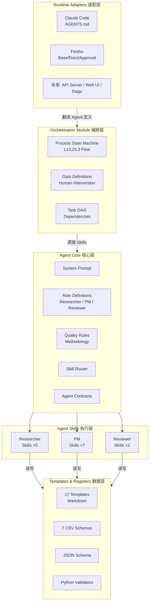
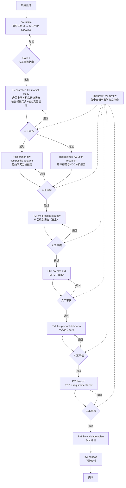
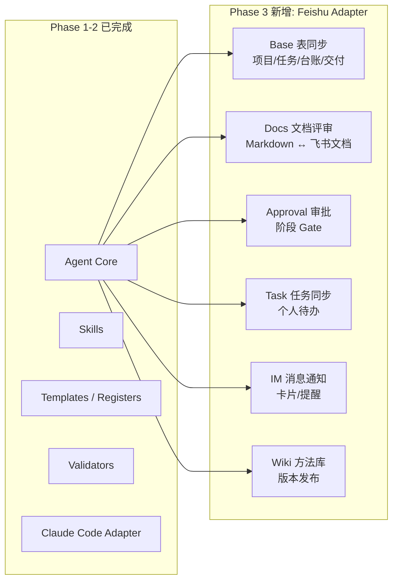

# 智能硬件 PM Agent — 完整实施方案

> 版本：v1.0
> 日期：2026-07-30
> 状态：设计定案，待实施

---

## 一、全面 Review

### 1.1 已覆盖的内容

- 3-Agent 架构（Researcher/PM/Reviewer）
- 16 个 Skills 清单和分工
- 5 个研究领域（市场/用户/竞品/合规/专利）
- 串行文档流 + 人工门径机制
- 报告内嵌摘要 + CSV 为唯一真相源
- 台账机制（7 个 CSV，traceability 为中心 JOIN 表）
- 跨项目学习机制
- pm-skills 审计结论和改造策略
- Runtime 可移植性设计

### 1.2 识别的遗漏（已补充进方案）

| # | 遗漏项 | 优先级 |
|---|--------|--------|
| 1 | System Prompt 详细设计（AGENTS.md 内容结构） | P0 |
| 2 | Agent 间通信协议（Researcher→PM→Reviewer 数据契约） | P0 |
| 3 | 项目初始化/脚手架（新项目创建需要的文件和初始台账） | P0 |
| 4 | 模块打包结构（目录组织、模块边界、接口定义） | P0 |
| 5 | Reviewer 对研究报告的审查（之前只讨论了审 PM 产出） | P0 |
| 6 | 任务包生成（hw-intake 路由批准后生成任务清单） | P1 |
| 7 | 复盘 + 下游交付 Skill（hw-retro、hw-handoff 补充） | P1 |
| 8 | 错误状态和恢复机制 | P1 |
| 9 | Feishu 集成架构（与 Claude Code MVP 的模块边界） | P1 |

### 1.3 实施过程中完善的细节

- 每个 SKILL.md 的具体措辞和示例
- 校验器的具体错误消息格式
- CSV 字段级别的验证规则细节
- 测试用例的具体内容
- 专利分析工具的具体选型

---

## 二、整体架构

### 2.1 模块化设计



### 2.2 模块接口

| 模块 | 输入 | 输出 | 依赖 |
|------|------|------|------|
| **Agent Core** | 项目方法论（模板包内容） | System Prompt、角色定义、质量规则、技能路由表 | 无 |
| **Skills** | Agent Core（角色+规则）、Templates（输出格式）、Registers（数据写入） | 研究报告、产品文档、台账记录 | Agent Core, Templates & Registers |
| **Templates & Registers** | 模板包（已有） | Markdown 模板、CSV Schema、JSON Schema、校验脚本 | 无（数据层） |
| **Orchestration** | Agent Core（流程规则）、Gate 定义 | 状态机、任务依赖、人工节点 | Agent Core |
| **Runtime Adapters** | Agent Core、Orchestration | Runtime 特定配置（AGENTS.md / Feishu Base 表结构等） | Agent Core, Orchestration |

### 2.3 关键设计原则

1. **Skills 不直接依赖 Runtime**：Skills 通过 Agent Core 定义的契约工作，不感知 Claude Code 还是 Feishu
2. **Templates & Registers 是纯数据层**：不包含执行逻辑，可被任何模块读取
3. **Orchestration 与 Runtime 分离**：流程状态机是纯逻辑，Runtime Adapter 负责将状态映射到具体平台
4. **模块间通过 ID 引用通信**：不传递完整文档，传递 artifact_id + version + hash

---

## 三、完整流程（串行 + 人工门径）



**关键规则**：
- 路由判定在项目启动时完成，不在研究之后
- 每个文档产出前必须经过 Reviewer 审核 + 人类 PM 审批
- 报告之间有输入输出依赖（对齐 00A 文档关系），不存在一次性加载
- 人类 PM 是门径的最终守门员

---

## 四、Researcher 研究领域

| 领域 | 产出 | 说明 |
|------|------|------|
| **市场研究** | 产品市场与机会研究报告 | 五看（行业/客户/竞争/自身/机会），含技术趋势和产业链分析 |
| **用户研究** | 用户研究与VOC分析报告 | 多角色链（安装工/使用者/决策者/维护者）、JTBD、用户旅程、痛点优先级 |
| **竞品分析** | 竞品研究分析报告 | 桌面数据、拆机、BOM反推、体验对标、供应链追溯 |
| **合规研究** | 产品合规研究报告 | 目标市场→标准→认证路径→周期→费用；按 L1/L2/L3 分级 |
| **专利分析** | 专利格局分析报告 | 专利地图、阻塞风险、空白区域；格局分析，不做法律判断 |

**技术可行性评估不属于 Researcher 范围**——那是 PRD 输出后，开发团队基于具体方案做的工程判断。

---

## 五、Skills 完整清单（16 个）

### 5.1 Researcher Skills（5 个）

| # | Skill | 输入 | 输出 | 写入台账 |
|---|-------|------|------|---------|
| R1 | `hw-market-study` | 项目启动卡、行业线索 | 产品市场与机会研究报告（含摘要 + 输入来源表） | evidence.csv, assumptions.csv |
| R2 | `hw-user-research` | 市场研究的候选用户人群、VOC 线索 | 用户研究与VOC分析报告（含摘要 + 输入来源表） | evidence.csv, assumptions.csv |
| R3 | `hw-competitive-analysis` | 市场研究的核心竞品清单 | 竞品研究分析报告（含摘要 + 输入来源表） | evidence.csv, assumptions.csv |
| R4 | `hw-compliance-research` | 目标市场、产品类型 | 产品合规研究报告（含摘要 + 输入来源表） | evidence.csv, assumptions.csv |
| R5 | `hw-patent-analysis` | 关键技术领域、竞品清单 | 专利格局分析报告（含摘要 + 输入来源表） | evidence.csv, assumptions.csv |

### 5.2 PM Skills（7 个）

| # | Skill | 输入 | 输出 | 写入台账 |
|---|-------|------|------|---------|
| P1 | `hw-intake` | 项目资料 + source-manifest | 启动卡 + 路由判定(L1/L2/L3) + Gate 1 简报 + **任务包** | decisions.csv（仅 Gate 1 人工批准后） |
| P2 | `hw-product-strategy` | 所有已批准研究 + evidence | 产品规划报告（三定+MVP+路线图） | decisions.csv |
| P3 | `hw-mrd-brd` | 产品规划报告 | MRD + BRD（L2 用合并版，L3 分别输出） | — |
| P4 | `hw-product-definition` | 产品规划 + MRD/BRD | 产品定义文档（定位/JTBD/MVP/边界） | — |
| P5 | `hw-prd` | 产品定义 + 约束 | PRD + requirements.csv | requirements.csv, traceability.csv |
| P6 | `hw-validation-plan` | PRD + 假设 + 风险 | 验证计划 | traceability.csv（更新） |
| P7 | `hw-gate-prep` | 各阶段产物 + Reviewer findings | Gate 摘要 + 选项分析 | decisions.csv（人工确认后） |

### 5.3 Reviewer Skills（2 个）

| # | Skill | 输入 | 输出 | 写入台账 |
|---|-------|------|------|---------|
| V1 | `hw-review` | Researcher 报告 或 PM 文档 + 台账 | findings（带 severity + required_action） | risks.csv（如发现新风险） |
| V2 | `hw-red-team` | PRD + 产品定义 + 假设 | 杀伤性假设 + 最便宜验证方案 | assumptions.csv（如发现新假设） |

### 5.4 补充技能（2 个）

| # | Skill | 输入 | 输出 | 写入台账 |
|---|-------|------|------|---------|
| S1 | `hw-retro` | 验证结果 + 阶段评审 + 上市反馈 | 项目复盘报告 | method_learnings.csv |
| S2 | `hw-handoff` | 已批准产物 + 团队映射 | 下游交付包（按硬件/固件/APP/测试/质量/供应链/售后拆包） | — |

**总计：16 个 Skills**

---

## 六、Agent 通信协议

### 6.1 Researcher → PM 的契约

```yaml
research-delivery:
  artifact_id: "ART-{project}-{seq}"
  artifact_type: "market_study | user_research | competitive_analysis | compliance | patent"
  report_path: "path/to/report.md"       # 完整报告（含摘要章节）
  summary: "<500字摘要>"                  # 从报告摘要章节提取
  evidence_ids: ["EV-001", "EV-002"]     # 新增 evidence 记录
  assumption_ids: ["A-001"]              # 新增 assumption 记录
  open_questions:                        # 需要 PM 决策的问题
    - question: "目标市场选择A还是B？"
      impacted_decisions: ["产品定位", "认证路径"]
  route_impact:                          # 对路由的影响
    - finding: "竞品C已覆盖目标价格带"
      may_affect: "定价策略"
  content_hash: "sha256..."
  maturity: "reviewed"                   # 经 Reviewer 审核通过
```

### 6.2 PM → Reviewer 的契约

```yaml
review-request:
  artifact_id: "ART-{project}-{seq}"
  artifact_type: "product_strategy | mrd | brd | product_definition | prd | validation_plan"
  artifact_path: "path/to/document.md"
  artifact_version: "v0.1"
  input_artifacts:                       # 上游输入（ Reviewer 需交叉验证）
    - artifact_id: "ART-001"
      version: "v1.0"
  content_hash: "sha256..."
  maturity: "draft"
```

### 6.3 Reviewer → PM 的契约

```yaml
review-result:
  review_id: "REV-{project}-{seq}"
  artifact_id: "ART-{project}-{seq}"
  artifact_version: "v0.1"
  verdict: "approved | conditional | rejected"
  findings:
    - finding_id: "F-001"
      severity: "blocker | high | medium | low"
      category: "evidence | scope | requirement | acceptance | validation | risk | consistency"
      location: "章节或对象ID"
      finding: "具体问题描述"
      evidence: "支持该判断的规则或证据"
      required_action: "must_fix | suggest | submit_decision"
  content_hash: "sha256..."
```

---

## 七、输出格式

### 7.1 研究报告结构

```markdown
# 报告标题

## 摘要（≤500字）
- 对路由有影响的发现
- 对产品定义有约束的发现
- 需要 PM 决策的开放问题

## 方法说明
...

## 正文（详细分析）
...

## 输入来源表（对齐 00A 3A 节）
| 输入项 | 状态 | 来源/证据 | 影响 | 处理方式 |
...
```

### 7.2 CSV 台账规则

- **索引唯一**：ID 格式 `{type}-{project}-{seq}`，不重复
- **数据可信**：每条记录必须标记 source + quality_level + confidence
- **数据完整**：关键结论必须登记，缺失输入标记为 gap
- **CSV 是权威**：报告和 CSV 冲突时，以 CSV 为准

---

## 八、台账机制

### 8.1 写入规则

| 台账 | 写入者 | 触发时机 |
|------|--------|---------|
| evidence.csv | Researcher | 发现关键事实时**立即**写入 |
| assumptions.csv | Researcher + PM | Researcher 标记未验证判断；PM 标记决策中的新假设 |
| risks.csv | PM + Reviewer | 发现风险时写入 |
| requirements.csv | PM（PRD） | PRD 编写时**同步**写入 |
| traceability.csv | PM | 建立证据→需求关联时**增量**追加 |
| decisions.csv | PM（Gate Prep） | Gate 评审后**人工确认**后写入 |
| method_learnings.csv | PM（复盘） | 项目复盘后写入 |

### 8.2 确定性校验规则（8 条）

| 规则 | 检查内容 | 严重级别 |
|------|---------|---------|
| V-01 | 每条 P0/P1 requirement 有 ≥1 条 traceability | blocker |
| V-02 | traceability 中引用的 evidence_id 存在 | blocker |
| V-03 | traceability 中引用的 requirement_id 存在 | blocker |
| V-04 | assumptions 中 confidence=高 但没有 validation_method | high |
| V-05 | risks 中 impact=高 但没有 mitigation | blocker |
| V-06 | evidence 的 quality_level 不为空 | medium |
| V-07 | ID 格式符合规范，无跨文件重复 | blocker |
| V-08 | 已批准 artifact 有关联 decision_id | blocker |

---

## 九、跨项目学习机制

新项目启动时，自动检索 method_learnings.csv 中匹配的记录：

- 匹配规则：`applies_to` 字段包含当前项目的品类/技术/市场关键词
- 仅提取共性或关联的经验教训（不加载全量历史）
- 加载到当前会话上下文，PM Agent 在 Gate 准备时检查是否重复了已知错误

---

## 十、实施阶段

### Phase 0：基础搭建（~2-3 天）

**目标**：完成设计定案 + Agent 核心就绪 + 项目脚手架

| 任务 | 产出 |
|------|------|
| 0.1 目录结构初始化 | 标准目录树 |
| 0.2 AGENTS.md 编写 | Agent System Prompt（方法论、3-Agent 角色、质量底线、技能路由表、台账规则） |
| 0.3 迁移 mvp-1 资产 | 8 个 JSON Schema + 4 个 Python 校验脚本 |
| 0.4 模板更新 | 研究报告模板增加"摘要"章节；新增合规研究和专利分析报告模板 |
| 0.5 Skill 编写范式文档 | SKILL_TEMPLATE.md |

**退出条件**：
- AGENTS.md 加载后，Agent 能正确回答"我是什么角色、我的质量底线是什么"
- validators/ 脚本能对示例台账输出通过/失败结果
- 模板包含摘要章节

---

### Phase 1：MVP — L1 本地闭环（~1-2 周）

**目标**：Claude Code 内跑通一个 L1 项目的完整流程

| 任务 | 产出 | 依赖 |
|------|------|------|
| 1.1 编写核心 Skills（8 个） | hw-intake, hw-market-study, hw-competitive-analysis, hw-user-research, hw-prd, hw-validation-plan, hw-review, hw-gate-prep | Phase 0 |
| 1.2 端到端 L1 测试 | 用真实 L1 样例跑通完整流程 | 任务 1.1 |
| 1.3 Reviewer 集成 | hw-review 作为子代理独立审查 | 任务 1.1 |
| 1.4 台账端到端验证 | evidence → traceability → requirements 完整链路 | 任务 1.2 |

**MVP 验证场景**：mvp-1 中的"无线链式开窗机指定电机降本"（L1）

**退出条件**：
- L1 项目从启动到验证计划全部通过 Agent 完成
- 每个文档产出前经过 Reviewer 审核
- traceability 链路完整
- 所有 Gate 节点有人工确认记录

---

### Phase 2：L2 + 完整 Skills（~2 周）

**目标**：扩展 L2 流程，补齐全部 16 个 Skills

| 任务 | 产出 | 依赖 |
|------|------|------|
| 2.1 补齐剩余 Skills（8 个） | hw-compliance-research, hw-patent-analysis, hw-product-strategy, hw-mrd-brd, hw-product-definition, hw-red-team, hw-retro, hw-handoff | Phase 1 |
| 2.2 L2 流程验证 | 用真实 L2 项目跑通 | 任务 2.1 |
| 2.3 跨项目学习 | method_learnings 检索 + 自动加载 | 任务 2.1 |
| 2.4 任务包自动生成 | hw-intake 输出中增加任务清单 | 任务 2.1 |

**退出条件**：
- L2 项目从启动到 PRD 全部通过 Agent 完成
- L2 MRD/BRD 合并版正确生成
- 跨项目学习机制生效

---

### Phase 3：飞书集成（~2-3 周）

**目标**：从 Claude Code 本地扩展到飞书工作台

**架构原则**：Feishu Adapter 只负责"翻译"——将 Agent Core 的 artifact/decision/task 对象同步到飞书。不修改 Agent Core 的任何逻辑。



| 任务 | 产出 |
|------|------|
| 3.1 飞书 Base 数据表 | Projects, Tasks, Reviews, Decisions, Deliveries 表（对齐文件 15 6.2 节） |
| 3.2 飞书 Docs 集成 | 本地 Markdown → 飞书文档评审副本 → 批准后发布 |
| 3.3 飞书 Approval 集成 | 阶段 Gate 使用飞书原生审批 |
| 3.4 飞书 Task 集成 | Base 任务 → 飞书任务同步（个人待办和提醒） |
| 3.5 飞书 IM 通知 | Gate 审批请求、Reviewer blocker、任务指派的消息卡片 |
| 3.6 飞书 Wiki 发布 | 批准后的方法更新发布到知识库 |

---

### Phase 4：L3 + 生产化（按需）

| 任务 | 说明 |
|------|------|
| 4.1 L3 完整流程 | 全部 11 份文档的端到端验证 |
| 4.2 多项目并行管理 | Base 项目总览、风险仪表盘 |
| 4.3 运行指标 | 效率/质量/决策/交付/Agent 指标（对齐文件 15 第 16 节） |
| 4.4 独立应用封装 | 从 Claude Code 完全解耦，独立部署 |

---

## 十一、目录结构

```
产品经理文档模版/
│
├── README.md                          # 总体说明（已有）
├── AGENTS.md                          # Agent System Prompt [Phase 0]
├── HANDOFF.md                         # 会话交接（已有）
│
├── templates/                         # 模板 [已有，Phase 0 微调]
│   ├── 00_项目启动卡.md
│   ├── 00A_文档关系与追踪说明.md
│   ├── 01_产品市场与机会研究报告.md    # 增加"摘要"章节
│   ├── 02_MRD_市场需求文档.md
│   ├── 03_BRD_商业需求文档.md
│   ├── 04_产品定义文档.md
│   ├── 05_PRD_产品需求文档.md
│   ├── 06_验证计划.md
│   ├── 07_MRD_BRD合并版_标准流程.md
│   ├── 08_流程裁剪判断表.md
│   ├── 09_竞品研究分析报告.md         # 增加"摘要"章节
│   ├── 10_用户研究与VOC分析报告.md     # 增加"摘要"章节
│   ├── 11_项目复盘与方法沉淀记录.md
│   ├── 12_L1_轻量产品定义_PRD合并文档.md
│   ├── 13_项目任务包与交付检查表.md
│   ├── 14_产品规划报告.md
│   ├── 15_AI产品经理工作流_方案A详细设计.md
│   ├── 16_项目启动引导式访谈与路由信息补全方案.md
│   ├── 17_产品合规研究报告.md          # [Phase 2 新增]
│   └── 18_专利格局分析报告.md          # [Phase 2 新增]
│
├── registers/                         # 台账 [已有]
│   ├── evidence.csv
│   ├── assumptions.csv
│   ├── risks.csv
│   ├── decisions.csv
│   ├── requirements.csv
│   ├── traceability.csv
│   └── method_learnings.csv
│
├── skills/                            # Agent Skills [Phase 1-2]
│   ├── SKILL_TEMPLATE.md              # Skill 编写范式 [Phase 0]
│   │
│   ├── researcher/                    # Researcher Skills (5)
│   │   ├── hw-market-study/
│   │   │   ├── SKILL.md
│   │   │   └── references/
│   │   ├── hw-user-research/
│   │   ├── hw-competitive-analysis/
│   │   ├── hw-compliance-research/
│   │   └── hw-patent-analysis/
│   │
│   ├── pm/                            # PM Skills (7)
│   │   ├── hw-intake/
│   │   │   ├── SKILL.md
│   │   │   └── references/
│   │   │       ├── question-tree.md
│   │   │       └── output-contract.md
│   │   ├── hw-product-strategy/
│   │   ├── hw-mrd-brd/
│   │   ├── hw-product-definition/
│   │   ├── hw-prd/
│   │   ├── hw-validation-plan/
│   │   └── hw-gate-prep/
│   │
│   ├── reviewer/                      # Reviewer Skills (2)
│   │   ├── hw-review/
│   │   └── hw-red-team/
│   │
│   └── shared/                        # Shared Skills (2)
│       ├── hw-retro/
│       └── hw-handoff/
│
├── validators/                        # 确定性校验 [Phase 0]
│   ├── schemas/                       # JSON Schema（从 mvp-1 迁移）
│   └── scripts/                       # Python 校验脚本（从 mvp-1 迁移）
│
├── adapters/                          # Runtime 适配器
│   ├── claude-code/                   # [Phase 0-2]
│   └── feishu/                        # [Phase 3]
│
├── orchestration/                     # [Phase 1-2]
│   ├── flows/（L1.yaml, L2.yaml, L3.yaml）
│   └── gates/（gate-definitions.md）
│
├── docs/
│   └── architecture.md               # 本方案文档
│
├── mvp-1/                             # 历史 MVP（保留参考）
└── archives/                          # 阶段归档
```

---

## 十二、关键风险

| 风险 | 影响 | 缓解措施 |
|------|------|---------|
| Skills 在 Claude Code 中的可靠性 | Agent 行为不稳定，跳过关键步骤 | 每个 Skill 有可检查的完成条件；Reviewer 独立验证 |
| 上下文窗口不足 | 长报告 + 多份文档超出上下文限制 | 摘要章节设计；PM Agent 先读摘要再按需回查原文 |
| 人工 Gate 过多导致效率低 | PM 感到流程繁琐 | Gate 按 L1/L2/L3 分级裁剪 |
| 台账数据漂移 | CSV 和报告内容不一致 | 确定性校验脚本在 Gate 前强制运行；CSV 是权威 |
| Feishu 集成复杂度 | Phase 3 延期 | Feishu Adapter 隔离在独立模块，不阻塞 Phase 1-2 |
